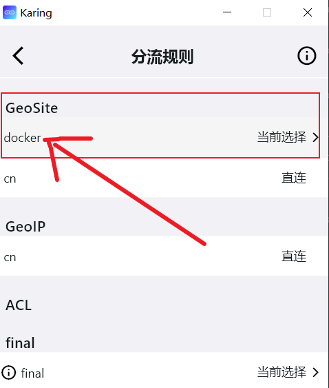
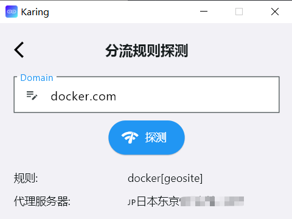
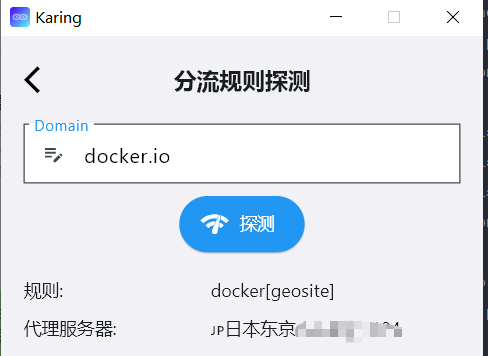
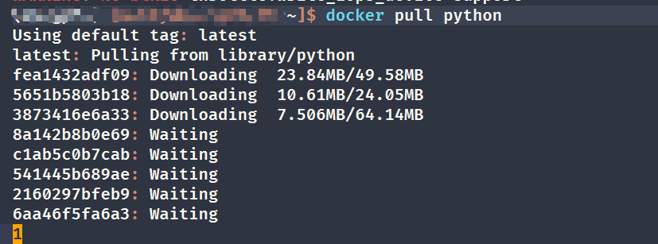
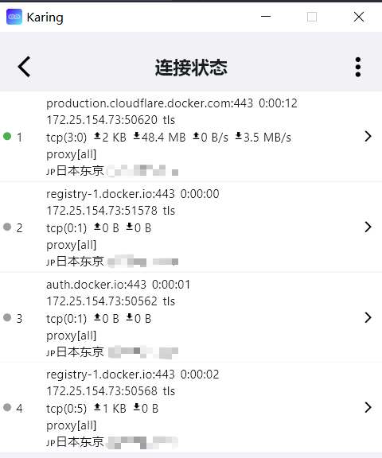

# 用karing打造docker加速器
- 当前因某些*不可抗力*导致国内大部分docker镜像服务不可用, 查了下大部分推荐自建镜像源、CF Workers镜像。
- 这里就提供一中直接走科学上网的方式, 绕过wall


## 物料
- Docker Engine: 26.1.3
- karing: [1.0.24.283](https://github.com/KaringX/karing/releases/tag/v1.0.24-283)


## 步骤
- 这次采用修改 `/etc/docker/daemon.json` 的方法,  感觉最简洁
- 修改systemd环境变量的方法 可直接按官方教程copy paste => [Configure the Docker daemon to use a proxy server](https://docs.docker.com/config/daemon/systemd/?highlight=proxy#httphttps-proxy)

### 1、创建自定义路由（可跳过）
- 本步可跳过: karing默认自带`geoip/cn`的规则, 会自动匹配非国内IP走代理
- 当然, 也可和我一样, 自定义一条针对 docker域名的路由
#### 创建自定义规则
- 1. 设置 -> 分流 -> *分流规则* -> 右上角修改按钮(✏图案)
  - -> 自定义分流组 右上角➕号 -> 备注 `docker`
  - -> 在规则列表中选择 *docker*
  - -> 下拉至内置规则 `Rule Set(build-in)`
  - 搜索选择  `geosite:docker`
  - 右上角 点击√保存

- 2. 设置 -> 分流 -> `分流规则` ->  `docker` -> 修改为 **当前选择**
  - 

#### 测试
- 设置 -> 分流 -> 最底下 `分流规则探测`
  - 测试 *docker.com* 和 *docker.io*
- 如下图:
  - 
  - 


### 2、获取karing代理IP地址和端口
- 设置 -> 网络共享 -> 打开 `允许其他主机接入`
  - 顺手查看 `网络接口` 得到当前IP地址, 比如: **172.25.83.1**
- 设置 -> `端口` -> 得到当前开放端口, 默认如下：
  - 全代理 **3066**

- 参考: [端口共享](/tutorial/lan#karing-设置)


### 3、添加docker proxy配置文件
- file: `/etc/docker/daemon.json`
  - 修改文件, 把其中IP/Port改成你自己的:
  ```jsx title="/etc/docker/daemon.json"
  {
     "proxies": {
          "http-proxy": "socks5://172.25.83.1:3066",
          "https-proxy": "socks5://172.25.83.1:3066"
      }
  }
  ```
- 重启docker daemon
```bash
$sudo systemctl daemon-reload
$sudo systemctl restart docker
```
- 检查变量
```jsx
$docker info

...
 Debug Mode: false
 HTTP Proxy: socks5://172.25.83.1:3066
 HTTPS Proxy: socks5://172.25.83.1:3066
...

```

### 4、拉取python最新镜像
- `docker pull python`
  - 
- 从karing查看连接日志
  - 
- 好啦，继续愉快玩耍！


## 补充
### docker服务使用代理的误区
- docker 镜像是由 docker daemon管理
  - 网上流传修改 shell 环境变量的方法不可用
  - docker老版本必须修改 systemd 的环境变量，新版>=23.0可使用 `daemon.json`
  - 客户端client对应的配置 `~/.docker/config.json` 也不会作用于镜像拉取
- 同理, 也无法通过*proxychains* 使用代理


### 自建docker镜像源
- [CRProxy (Container Registry Proxy)](https://github.com/wzshiming/crproxy/blob/master/examples/default/README.md)


