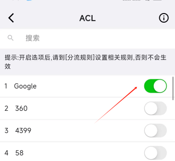
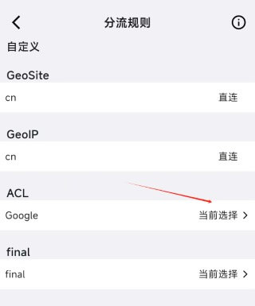
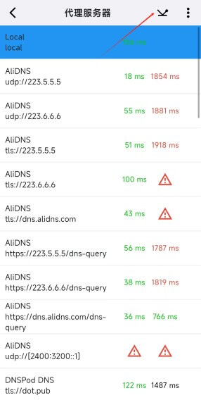
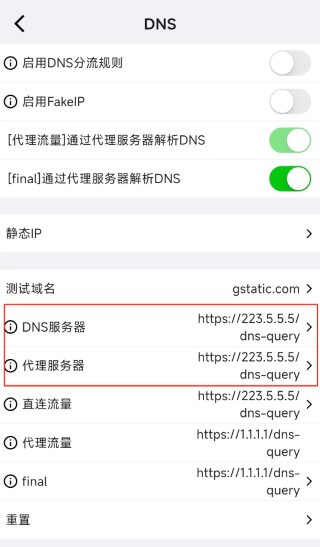
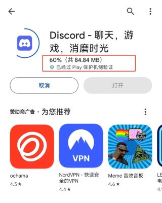
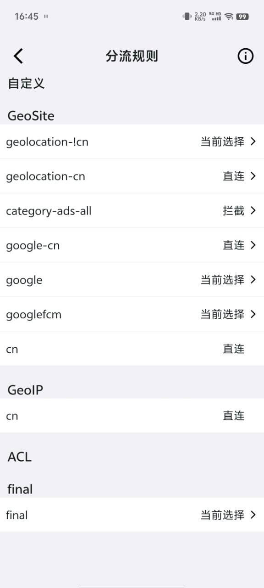
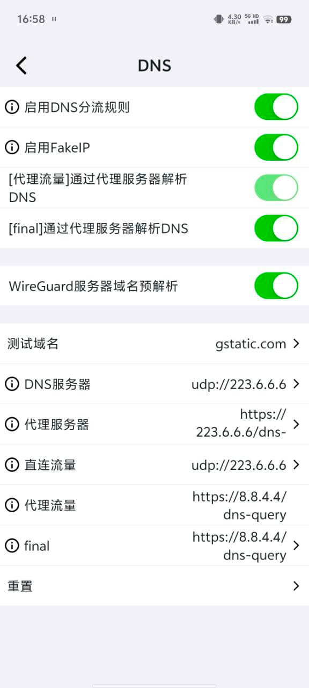

# 解决大陆用户 Google Play 商店无法下载或更新应用的问题
- 有的时候 play商店的应用能正常浏览，但无法下载或更新。
- 究其原因 无非几个:
  - google play下载的cdn域名不在分流规则中
  - 域名被DNS错误解析成国内IP
  - 代理节点无法解析/连接play对用域名

## Karing 配置
- 思路是先分析play商店使用的域名, 再修改对应分流规则, 最后设置正确的DNS
### google play商店使用的域名

```jsx
doamin:googleapis.cn
doamin:googleapis.com
doamin:xn--ngstr-lra8j.com
```

### 分流规则
- 使用规则 `acl:Google` , 具体包含域名可对照文件: [Google.json](https://github.com/KaringX/karing-ruleset/blob/sing/ACL4SSR/Ruleset/Google.json)
- 设置步骤：
  - **开启规则**: Karing 设置 -> 分流 -> ACL -> 启用, ACL -> 搜索并开启 Google
  - **定义动作**: 分流 -> 分流规则 -> ACL -> Google -> *当前选择*

- 如下图
  - 
  - 

### DNS
- 设置步骤：
  - **测试可用DNS**: Karing 设置 -> DNS -> DNS服务器 -> 右上角 *DNS测速*
  - **设置DNS**: DNS -> DNS服务器、代理服务器 -> 选择你测得最快的dns server
- 如下图
  - 
  - 

### 使用Play商店
- 


## 其他版本
- 这个版本是 [karing群](https://t.me/KaringApp)中 明星用户[@William Wu] 的分享，感谢！
- 该思路是
  - 分流设置
    - `geosite:geolocation-!cn` 非大陆域名 *当前选择*
    - `geosite:google-cn` *直连*
    - `geosite:google` *当前选择*
  - 再配置正确的DNS
- 请参考以下截图
    - 
    - 


