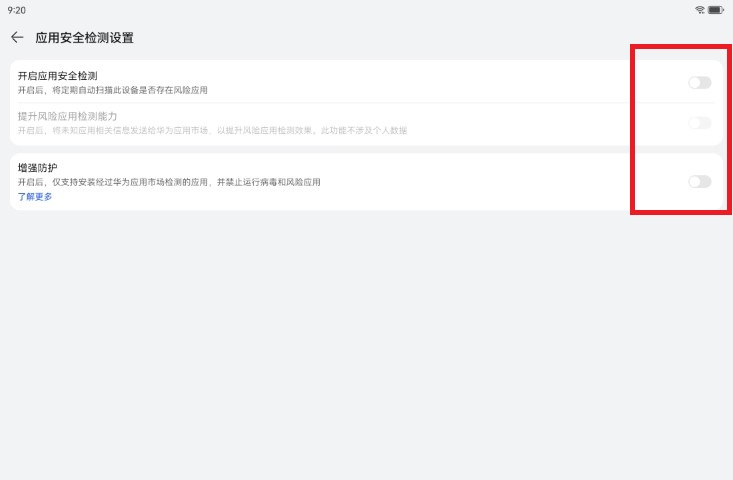

# 华为鸿蒙系统安装代理软件karing

## 物料
- 鸿蒙：
	- HarmonyOS 4.2.0
- karing：
	- [karing_1.0.23.275_android_arm64.apk](https://github.com/KaringX/karing/releases/download/v1.0.23-275/karing_1.0.23.275_android_arm64.apk)
- 代理节点的订阅链接

## 步骤
### 1. 关闭鸿蒙系统 安全设置
- 打开华为应用市场，进入`我的` - 应用安全检测 - **右上角** 设置图标，
	- 关闭`应用安全检测`
	- 关闭`增强防护`
	- 如下图：
- 关闭`增强防护`另一个入口是 设置 - 系统和更新 - 纯净模式

### 2. 安装karing
- 下载karing apk至存储中, 如果不能访问GitHub, 使用第三方云存储中转下, 比如百度云盘、阿里云盘之类.
- 打开系统自带的 `文件管理器`, 点击apk安装，允许安装应用
    - 如下图：
- 出现`安全提醒` - 勾选 `了解此应用风险` - 点击 **继续安装**
    - 如下图: 

### 3. karing配置
- 安装完成之后，打开karing，添加配置，配置填入准备好的`节点订阅链接`
- 返回karing首页, 点击 `连接`， 允许 `连接请求`
  - 如下图: 

### 4.异常处理
#### 在线规则报错
- 第一次连接有可能报错, 错误信息类似下载 **geo-ip/geo-site** timeout 等...
  - 这是因为代理未连接之前，sing-box内核无法下载到在线规则
- 解决方法:
  - karing内置分流规则, 先禁用机场规则即可
  - 操作: 设置 - 分流 - `禁用ISP分流规则`
  - 重连: 返回首页，点击连接按钮

