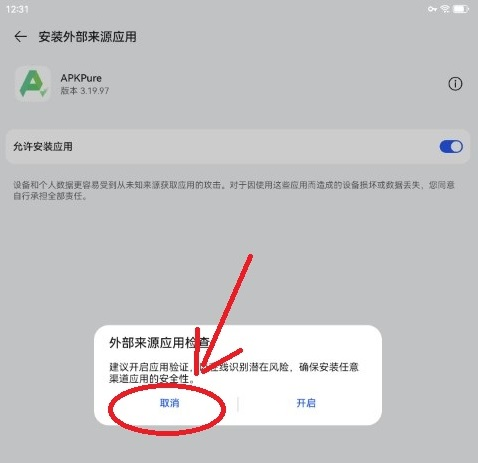
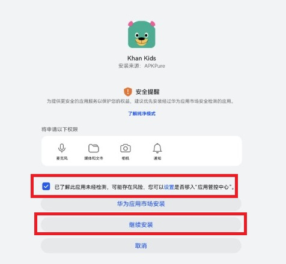
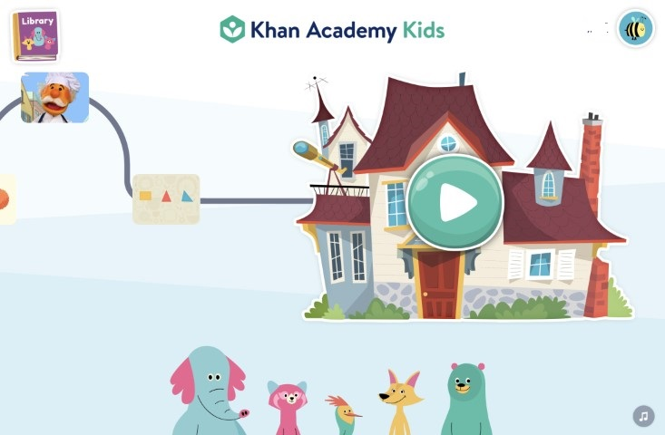

# 鸿蒙系统安装可汗学院儿童版(Khan Academy Kids)

## 关于Khan Academy Kids
- 体验过七八款国内外儿童学习软件，可汗学院儿童版是免费中最好的, 能根据小朋友每一个活动(activity)中的表现，规划个性化的学习路线。
- 其中包括 英语启蒙、数学、阅读、逻辑等课程，基本上可以类比洪恩思维全家桶。
- 然而国内应用市场上的 同名APP，基本都是卖广告的假应用...可怕😱
- 以下讲解怎么在鸿蒙OS上安装khan kids

## 物料
- 鸿蒙：
	- HarmonyOS 4.2.0
- apkpure:
	- [APKPure_v3.19.97_apkpure.com_1109.apk](https://apkpure.com/apkpure/com.apkpure.aegon/download/3.19.99?utm_content=1006&icn=aegon&ici=text_home-m&from=text_home-m)

## 步骤
### 一. 安装APKPure
- 关闭鸿蒙OS安全设置 和 安装APKPure 与上篇文章步骤一致，不再赘述
  - 快速链接👉🏻[鸿蒙OS安装karing](/blog/case/harmonyos#步骤)

- 先打开karing - 打开代理连接, 否则 APKPure 无法使用，需要 **科学上网**

### 二. 安装可汗学院儿童版
- 1 APKPure搜索栏键入 `Khan Academy Kids`
  - 点击对应版本页，**下载**
    - 
- 2 下载完成，点击安装, 允许APKPure`安装外部应用`
  - 注意 **取消** `外部应用安全检查` 
- 3 勾选 `了解安全提醒` - 继续安装 
- 安装完成

### 三、使用
- 大部分情况下，安装完Khan Kids之后，都能正常使用. 但也有一些时间需要**科学上网**
  - 推荐搭配 [karing](/) 食用最佳

- 运行界面: 

