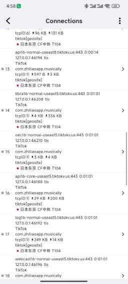
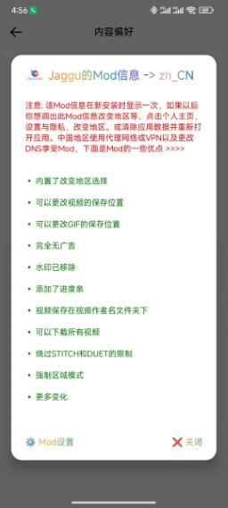
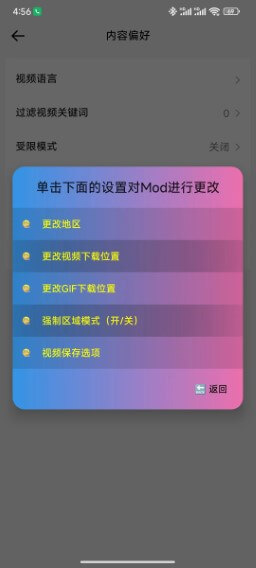

---

authors: [elon]
tags: [tiktok,免拔卡,解除地区,去广告]
---
# karing代理Android版TikTok流量

## TikTok下载，去广告，免拔卡解除地区封锁版
- 安卓版下载地址 https://t.me/tiktalktik
  - 这是印度大神破解的抖音国际版 Tiktok

:::tip Jaggu的Mod信息
中国地区使用代理网络或VPN以及更改 DNS享受Mod，下面是Mod的一些优点>>>>

- 内置了改变地区选择
- 可以更改视频的保存位置
- 可以更改GIF的保存位置 完全无广告
- 水印已移除
- 添加了进度条
- 可以下载所有视频
- 视频保存在视频作者名文件夹下
- 绕过STITCH和DUET的限制 强制区域模式

:::

### 使用说明
- 这里使用karing自带GeoSite规则, 当然, 使用[分应用模式更好](#分应用代理模式)
  - 本例使用分流规则的原因是便于把tiktok流量走*日本*节点

### 设置步骤
1. 通过[telegram](https://t.me/tiktalktik)下载apk文件
   - 本例使用文件 *TikTok_31.7.3_v8a.apk*
2. 安装apk文件
   - 如果是华为鸿蒙, 并不保证能用, 安装方法参考: [鸿蒙系统安装karing](/blog/case/harmonyos)
3. karing 分流
   - **开启规则**: Karing 设置 -> 分流 -> *分流规则* -> 右上角修改按钮(✏图案)
     - -> 自定义分流组 右上角➕号 -> 备注 `tiktok`
     - -> 在规则列表中选择 *tiktok*
     - -> 下拉至内置规则 `Rule Set(build-in)`
     - 搜索选择  `geosite:tiktok`
     - 右上角 点击√保存
   - **定义动作**: 分流 -> 分流规则 -> `tiktok` -> 选择 **日本节点**(本例账号地区选日本)
      - 当然，你也可以使用 **当前选择**

   - 回到karing首页 重新连接
4. 打开 tiktok
   - 正常浏览
     -  

    - 检查下 karing 连接情况
      - 

## 分应用代理模式
- 操作步骤请参考 [分应用代理](/tutorial/perapp-proxy)
- karing -> 设置 -> TUN -> 分应用代理 -> 打开"启用", 勾选"白名单模式", 搜索勾选 `TikTok`
- 回到karing首页 重新连接

## Jaggu的Mod信息

