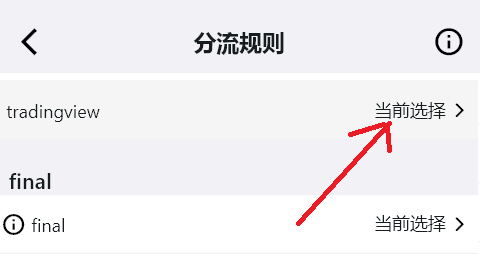
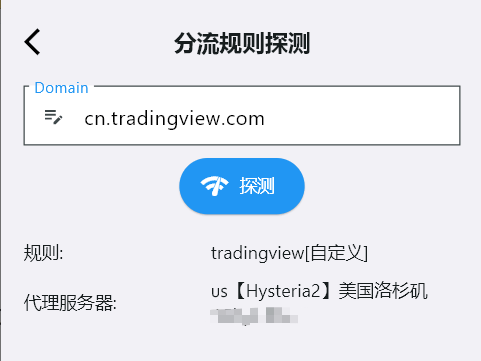

# 自定义分流规则访问 Tradingview
- 做投资的朋友对tradingview一定不陌生, 它是一个比较好用的工具, 但`cn.tradingview.com`在国内无法使用。
- 之前使用clash for windows（CLF）的时候，通过设置parsers来保存自定义规则，否则每次更新机场订阅, 自定义规则将被覆盖（丢失）。
- 本例就通过**karing**简单的自定义分流规则来实现tradingview的访问.

## 操作步骤
1. 添加分流组
  - 设置 —> 分流 -> `自定义分流组` -> 右上角➕号, 添加一个分流组, 写上备注 tradingview

2. 添加规则
  - 返回 `自定义分流组` 列表, 选择刚才的 备注名
  - 填入需要的规则, tradingview:
    - `Domain Suffix` 处填入 ".tradingview.com"
    - 左上角✔保存

3. 选择规则匹配动作
  - 设置 —> 分流 -> `分流组规则` ->  第一屏 自定义组下，选择 tradingview
  - 选择动作 **当前选择** 或者中意的节点
    - 
4. 返回karing首页, 重连使设置生效
  - 关闭"连接"按钮, 再打开连接, 此时按钮背景为绿色
5. 测试下是否可以
  - 设置 -> 分流 -> 最底部 `分流规则探测` -> 输入 `cn.tradingview.com` 探测
    - 
  - 浏览器打开 tradingview , 🆗

