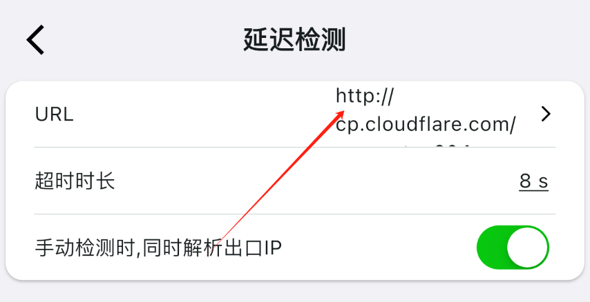
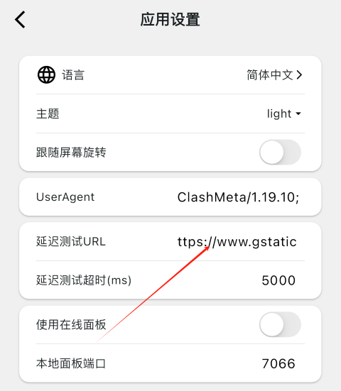

## why
- 有时候 karing/clash 延迟检测(连通性测试、ping)会很慢, 甚至超时, 即使重设DNS也没有效果.
  - 也表现为 **节点可以用，但显示感叹号，连接超时**
- 这是因为有些机场节点, 本地DNS设置的关系, 获取了错误的`www.gstatic.com` IP
  - 而一般软件默认的`url-test`地址, 就是 *http://www.gstatic.com/generate_204*
- 这个时候直接替换成新地址是最便捷的方法

## 如何替换?

### Karing
- 设置 -> 延迟检测 -> URL
- 

### ClashMi
- 应用设置 -> 延迟测试URL
- 

## url-test网址列表
- **注意**: 最好替换为与原地址不同的提供者
- 列表:

| 提供者     | 链接                                                                                                   | 返回(HTTP CODE）           |
| ---------- | ------------------------------------------------------------------------------------------------------ | -------------------------- |
| Google     | [http://www.gstatic.com/generate_204](http://www.gstatic.com/generate_204)                             | 204                        |
| Google     | [http://www.google-analytics.com/generate_204](http://www.google-analytics.com/generate_204)           | 204                        |
| Google     | [http://www.google.com/generate_204](http://www.google.com/generate_204)                               | 204                        |
| Google     | [http://connectivitycheck.gstatic.com/generate_204](http://connectivitycheck.gstatic.com/generate_204) | 204                        |
| Apple      | http://captive.apple.com                                                                               | 200 Success                |
| Apple      | https://www.apple.com/library/test/success.html                                                        | 200 Success                |
| MicroSoft  | http://www.msftconnecttest.com/connecttest.txt                                                         | 200 Microsoft Connect Test |
| Cloudflare | http://cp.cloudflare.com/generate_204                                                                  | 204                        |
| Firefox    | [http://detectportal.firefox.com/success.txt](http://detectportal.firefox.com/success.txt)             | 200 success                |

