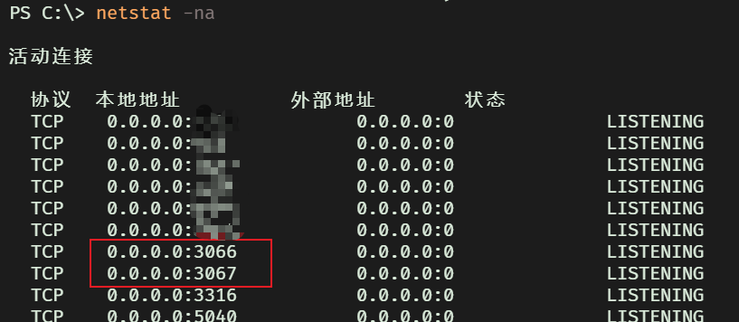

# 在wls2中使用karing的代理端口

## karing设置
- 1 设置 - 网络共享 - 允许其他主机接入
- 2 设置 - 端口
  - 基于规则 默认 **3067**
  - 全代理 默认 **3066**
- 3 返回主页 - 点击连接按钮

- 4 查看windows开放端口(可选)
```bash
netstat -na
```
    


## wsl2测试端口是否可访问
- 1 获取host ip
  - 方法A karing - 设置 - 网络接口
    - vEthernet(WSL)的IP
  - 方法B wsl2 - 查看resolv.conf中的nameserver
  ```bash
  grep nameserver /etc/resolv.conf  | awk -F ' ' '{print $2}'
  ```

- 2 测试连接
  - 假定 host ip是 *172.31.160.1*
  - 假定 wsl2使用默认网络模式NAT
```bash
$ telnet 172.31.160.1 3066
Trying 172.31.160.1...
Connected to 172.31.160.1.
Escape character is '^]'.

```
  - 如果出现 *Connected* 则表示连接成功，可直接使用
  - 出现 *time out* 则连接失败，大概率是win防火墙的问题


## windows防火墙设置
### 第一步 清空karing相关规则
- windows开始菜单 - 控制面板 - 系统和安全 - 防火墙/查看防火墙状态 - 高级设置(左侧栏) - **入站规则**
- 规则按名称排序 - 删除所有 **karing** 开头相关规则
### 第二步 新建规则
#### 方案A 基于端口
- 操作(右侧栏) - 入站规则/新建规则 - 端口 - TCP/特定端口 *3066* - 允许连接 - 全选域和网络位置 - 名称 - 完成
#### 方案B 基于程序
- 操作(右侧栏) - 入站规则/新建规则 - 程序 - 选择*karingService.exe* 绝对路径 - 允许连接 - 全选域和网络位置 - 名称 - 完成

新建规则之后，再次切换回wsl2中使用telnet测试连接。


## proxychains-ng
- 1 安装
  - archlinux系 `sudo pacman -Sy proxychains-ng`
  - debian系 `sudo apt install proxychains4`

- 2 编辑 /etc/proxychains.conf
```jsx title="/etc/proxychains.conf"

[ProxyList]
socks5   172.31.160.1 3066
```
- 3 使用cf节点测试下
```base
$ proxychains4 curl https://cip.cc
[proxychains] config file found: /etc/proxychains.conf
[proxychains] preloading /usr/lib/libproxychains4.so
[proxychains] DLL init: proxychains-ng 4.17
[proxychains] Strict chain  ...  172.31.160.1:3066  ...  cip.cc:443  ...  OK
IP      : 104.28.193.104
地址    : CLOUDFLARE.COM  CLOUDFLARE.COM

数据二  : 美国

数据三  : 美国

URL     : http://www.cip.cc/104.28.193.104
```

