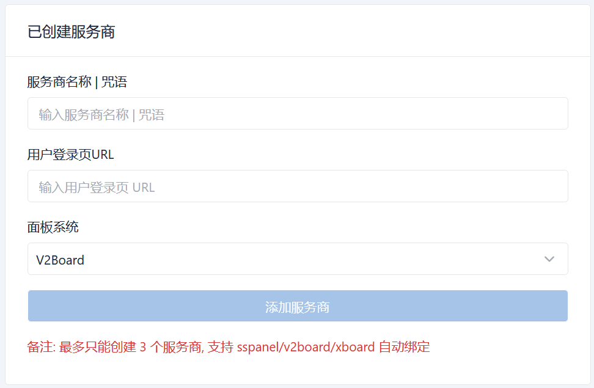
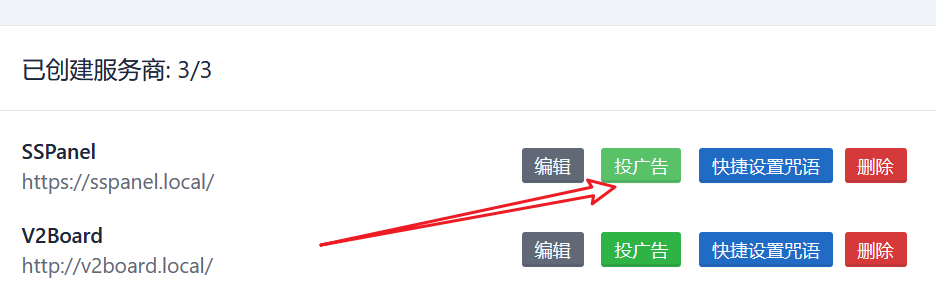
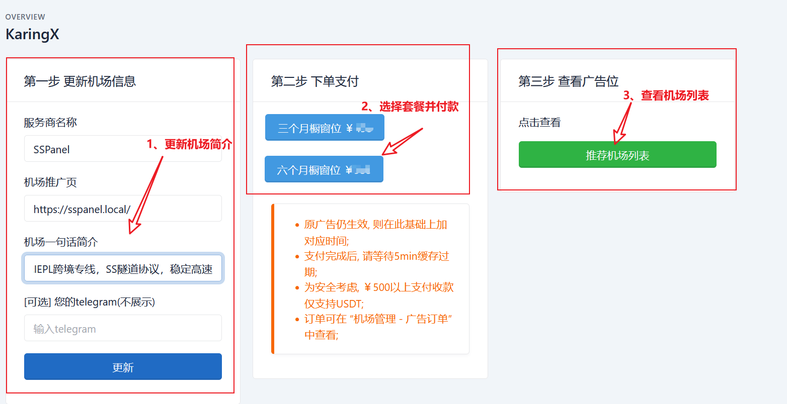

# ISP合作公告 | Collaboration Announcement

## 中文区农场主 | 自助投放广告
- 在karing中投广告, 让机场也出现在 [karing的推荐页](https://1.x31415926.top/cn.html)
- 可在 `harry.karing.app` 自助下单投放.
### 步骤
- 1 注册 https://harry.karing.app/
  - 创建服务商
    - 
- 2 进入投放页面
  - 点击对应机场投放页
    - 
  - 修改简介 + 下单
    - 
- 3 确认推荐列表


- **注意:**
  - 如遇问题或有意深度合作者, 请telegram联系 [@ElonWang](https://t.me/ElonWang)
  - 动手能力比较强的朋友，可在Karing中集成您的机场, 用户将体验到**登录即订阅**的快捷操作 👉[连接到Karing](/cooperation/connect)

## for VPN providers from other regions
- If you want your service to be featured on [the karing recommendation page](https://1.x31415926.top/en.html), or if you prefer other collaboration methods, please send an email to us at ElonWang2@outlook.com
- Example Email
```
- Title: Karing Collaboration + Your Service Name
- Content:
    - 1、 A concise recommendation of your service.
    - For instance: [French fries cloud] A 6-year-old stable service offering IPLC, CN2/GIA, and comprehensive transit technologies. Unlimited device access to streaming services like Netflix, Hulu, HBO, Anime Crazy, and TVB. Customizable private dedicated lines available.
    - 2、 [Optional] Mention of karing on your client download page.
```


