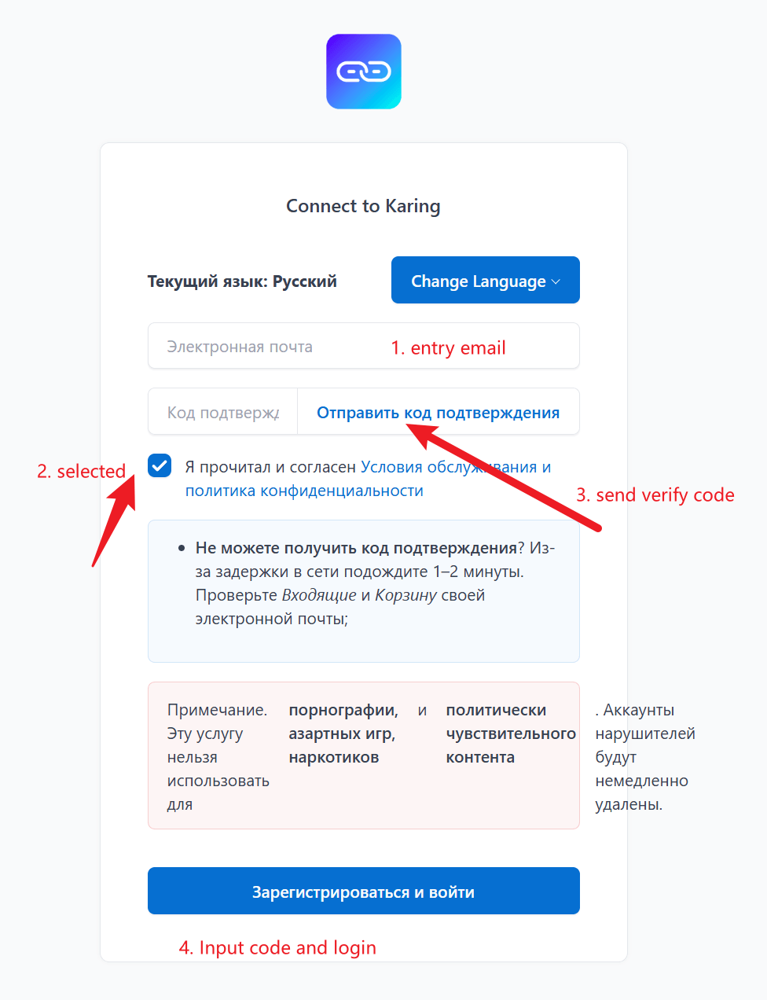
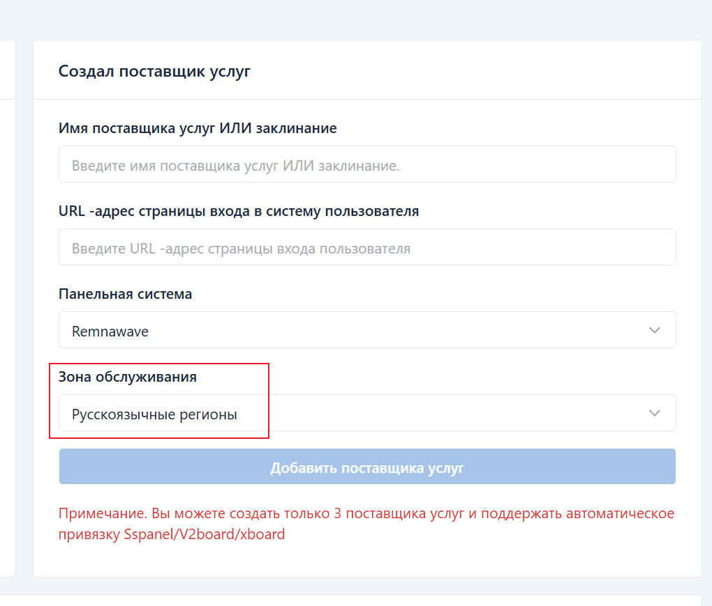
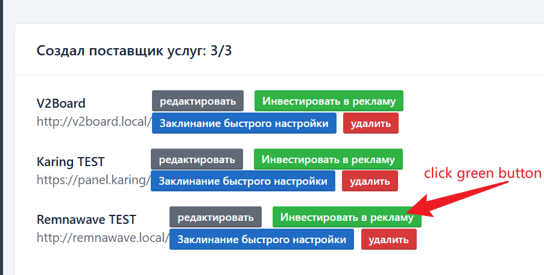
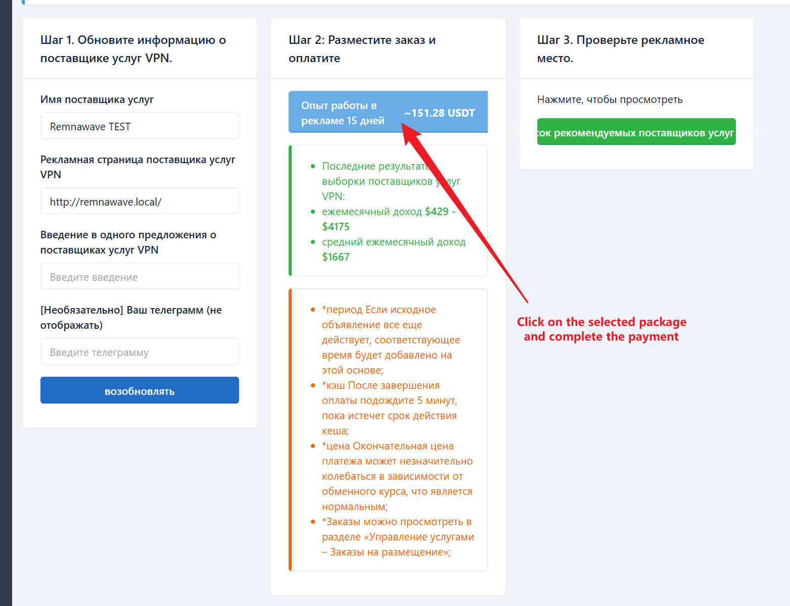

# Процесс размещения рекламы для VPN-провайдеров

## Самостоятельное размещение рекламы
- Разместите рекламу в karing, чтобы ваш сервис появился на [странице рекомендаций karing](https://dot.karing.app/pi.html?r_c=ru)
- Вы можете самостоятельно разместить рекламу на `harry.karing.app`
- Ниже приведены шаги

### 1. Зарегистрируйтесь на [harry.karing.app](https://harry.karing.app/auth/login?l_t=ru-RU)
- Войдите на [harry.karing.app](https://harry.karing.app/auth/login?l_t=ru-RU), используя электронную почту
  - 

- Создайте провайдера
  - 

### 2. Перейдите на страницу размещения рекламы
  - Нажмите кнопку «Разместить рекламу» у соответствующего VPN-провайдера
    - 
  - Отредактируйте описание + выберите тариф + завершите оплату
    - 

### 3. Подтвердите список рекомендаций

- **Примечание:**
  - Если возникли проблемы или есть желание углубить сотрудничество, свяжитесь с [@ElonWang](https://t.me/ElonWang) в Telegram
  - Продвинутые пользователи могут интегрировать свой сайт в Karing, и пользователи смогут подключиться по подписке одним входом 👉[Подключение к Karing](/cooperation/connect)


## for VPN providers from other regions
- If you want your service to be featured on [the karing recommendation page](https://dot.karing.app/pi.html?r_c=us), or if you prefer other collaboration methods, please send an email to us at ElonWang2@outlook.com
- Example Email
```
- Title: Karing Collaboration + Your Service Name
- Content:
    - 1、 A concise recommendation of your service.
    - For instance: [French fries cloud] A 6-year-old stable service offering IPLC, CN2/GIA, and comprehensive transit technologies. Unlimited device access to streaming services like Netflix, Hulu, HBO, Anime Crazy, and TVB. Customizable private dedicated lines available.
    - 2、 [Optional] Mention of karing on your client download page.
```


