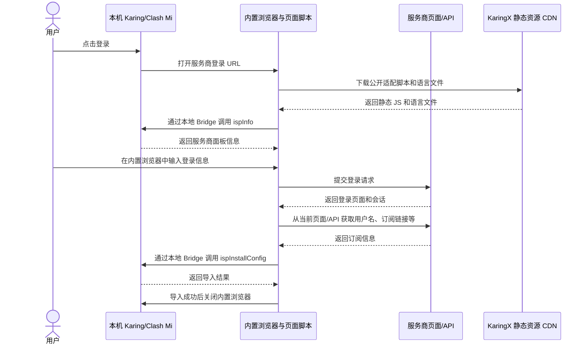

# Karing/Clash Mi“登录”功能的技术原理与 OAuth 对比

这里的“登录”不是登录 KaringX，也不是由 KaringX 代为登录。Karing/Clash Mi 使用 APP 内置浏览器打开服务商原有登录页；用户登录后，页面适配脚本从当前页面或服务商 API 取得订阅信息，再通过本地 Bridge 导入 APP。

这套方案有三个核心特点：

- 服务商面板无需改动。
- 无需集中维护 APP 用户与服务商用户的映射关系。
- 机场账号密码和订阅链接不记录在 KaringX 业务后端。

## 服务商管理后台配置了什么

服务商在公开的[服务商管理后台](https://harry.karing.app/provider)中配置面板类型、服务商主页 URL 和登录 URL。APP 据此打开正确页面，并选择对应的公开适配脚本。

该后台管理的是服务商级配置，不参与用户认证，也不接收或保存本次登录使用的账号密码和取得的订阅链接。

## 登录与配置导入流程

当前实现中，CDN 返回静态 JS 和语言文件，返回的脚本在 WebView 页面上下文执行；当前代码不把账号、token 或订阅数据发送到 KaringX 业务后端或 CDN。

具体步骤如下：

1. 用户在 APP 中点击登录，APP 打开服务商配置的登录 URL。
2. `bind.js` 通过本地 Bridge 调用 `ispInfo`，取得服务商面板信息。
3. 脚本根据面板类型加载 `sspanel.js`、`v2board.js` 或 `xboard.js`。
4. 用户直接在机场原有页面登录，账号密码提交给服务商。
5. 适配脚本取得用户名、Clash 订阅链接和显示名称，再由 `karing.js` 调用 `ispInstallConfig`。
6. APP 在本机导入配置，成功后关闭内置浏览器。

## 不同面板如何取得订阅

- **SSPanel**：扫描页面中的 `clash://install-config` 链接，并尝试从页面取得邮箱。
- **V2Board**：调用 `/api/v1/user/getSubscribe` 和 `/api/v1/user/subscribe` 获取用户及订阅信息。
- **XBoard**：调用当前机场域名或 `api.` 子域上的兼容接口，并兼容不同的响应结构。

显示名称按面板分别取安装链接中的名称、页面设置或 HTML `title`，缺失时使用占位值；用户名优先取接口返回值或页面邮箱，缺失时使用占位值。订阅链接是完成导入的必需项。

脚本最长轮询约 10 分钟。接口暂时未返回订阅链接时会继续重试；如果 APP 导入失败，页面会显示错误信息。适配代码已在 [KaringX/karing-connect](https://github.com/KaringX/karing-connect) 公开，服务商和用户可以审计，服务商也可以自行部署。

## 用户数据去了哪里

| 数据 | 去向与用途 |
| --- | --- |
| 账号密码 | 仅提交给服务商的原登录页面，用于服务商认证。 |
| 页面 token/Cookie | 页面 token 或 Cookie 用于请求服务商自己的页面/API；适配脚本不会将其作为 Bridge 参数传给 APP，也不会主动发送到 KaringX 业务后端。 |
| 用户名、订阅链接、显示名称 | 仅通过本地 Bridge 导入本机 APP。 |
| 适配脚本、语言文件请求 | 发往默认的 KaringX 静态资源 CDN；请求会像普通 CDN 请求一样产生 IP、User-Agent 等网络元数据，返回的脚本在 WebView 页面上下文执行。 |

`ispInstallConfig` 接收服务商标识槽位、用户名、订阅链接和显示名称；当前脚本将标识槽位置空，由 APP 使用已有服务商上下文；参数不包含页面 token/Cookie。

默认 CDN 是运行期静态资源和代码分发信任依赖。CDN 通常具备高可用分发能力，但在资源未缓存或需要更新时若不可用，页面适配可能无法继续。它不是认证中介或集中用户数据后端。服务商可自托管开源脚本，去除对默认分发源的可用性和代码供应链依赖。

## 与 OAuth 方案对比

OAuth 不天然要求 KaringX 充当中介。它既可以由 KaringX 统一中介，也可以由 APP 使用 PKCE 直接连接各服务商。三种架构的差异如下：

| 方案 | KaringX 用户关系 | KaringX 故障影响 | 优点 | 代价 |
| --- | --- | --- | --- | --- |
| 当前 WebView 导入 | 无需集中映射 APP 用户与服务商用户 | KaringX 不是认证中介；需要下载资源时，默认 CDN 不可用可阻断页面适配 | 面板无需改动，可复用现有登录页，账号密码和订阅链接不进入 KaringX 业务后端 | 需要按面板维护页面/API 适配，页面变化可能需要更新脚本 |
| KaringX 统一中介 OAuth | 中介通常处理或保存账号关联、token 或授权状态 | 故障会阻断经过中介的新授权、回调、code 换 token 和刷新，形成授权控制面单点 | 可统一客户端接入、回调和授权体验 | KaringX 承担集中授权状态、安全、可用性和隐私责任 |
| APP 直连服务商 OAuth + PKCE | 无需 KaringX 用户关系 | KaringX 故障不影响 APP 与服务商直接授权，不形成 KaringX 中介单点 | 标准授权流程，避免向 KaringX 集中用户关系和凭据 | 各服务商需规范实现 OAuth、客户端注册和回调；APP 需管理实现差异及 token 生命周期 |

### OAuth 是否要求 KaringX 保存用户关系

不一定。OAuth 协议本身没有这个要求。

如果采用 KaringX 统一中介，中介通常需要处理或保存 APP 用户与服务商授权之间的关联、token 或授权状态，以完成回调、换取 token 和后续刷新。

如果 APP 使用 OAuth + PKCE 直连服务商，授权关系可以只存在于 APP 和服务商之间，无需 KaringX 保存用户关系。代价是每个服务商都要提供规范的 OAuth 能力，并处理客户端注册和回调约定。

### KaringX 服务器故障是否会导致服务商无法登录

- **KaringX 统一中介 OAuth**：会影响经过中介的新授权、回调、code 换 token 和刷新操作。
- **APP 直连服务商 OAuth + PKCE**：不会因为 KaringX 服务器故障而无法向服务商授权。
- **当前 WebView 方案**：不构成 KaringX 认证中介单点，但需要下载资源时，默认 CDN 不可用会影响页面适配；可通过自托管去除。

已有的有效配置不会因为中介临时故障而立即失效；这类故障主要影响授权控制面，而不是已导入配置的即时使用。

## 为什么采用 WebView 方案，而不是 OAuth + PKCE？

从协议设计看，APP 直连服务商 OAuth + PKCE 是一个干净的方案：KaringX 不需要成为中介，也不需要保存用户关系。但落到现有机场生态中，它的接入成本并不低。

目前常见的开源面板，包括 SSPanel、V2Board 和 XBoard，并没有一套可以直接复用的统一 OAuth + PKCE 接入方案。不同面板需要分别开发；即使是同一类面板，不同版本、不同分支和不同二次开发代码也可能存在实现差异。服务商若采用这一路线，就需要承担 OAuth 服务端能力、客户端注册、回调处理、token 生命周期、安全审计和后续兼容维护等工作，接入工作量和不确定性都会明显增加。

WebView 方案选择的是另一条更贴近现状的路径：复用服务商已经稳定运行的登录页和订阅接口，不要求服务商重做授权系统，也不要求 KaringX 建立集中用户映射。对服务商来说，这通常是工作量最小，甚至几乎不需要改造的接入方式；对用户数据链路来说，也更直接、清晰，账号密码仍只提交给服务商，订阅信息只进入本机 APP。

## 总结

Karing/Clash Mi 当前的“登录”本质上是内置浏览器中的本地配置导入流程。KaringX 提供服务商级配置及默认静态脚本分发，但不代理用户登录，也不建立集中的 APP 用户与服务商用户关系。

相比之下，统一中介 OAuth 能统一授权体验，但会引入集中关联、授权状态和控制面单点；当前 WebView 方案以维护面板适配为代价，复用服务商现有登录能力。只有 APP 直连服务商的 OAuth + PKCE 方案同样能够避免 KaringX 中介单点，但需要服务商和 APP 共同承担更规范的 OAuth 接入与生命周期管理。
