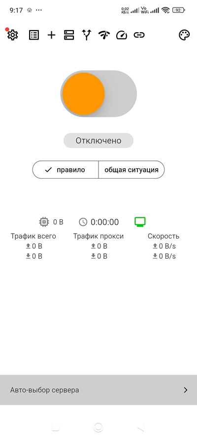
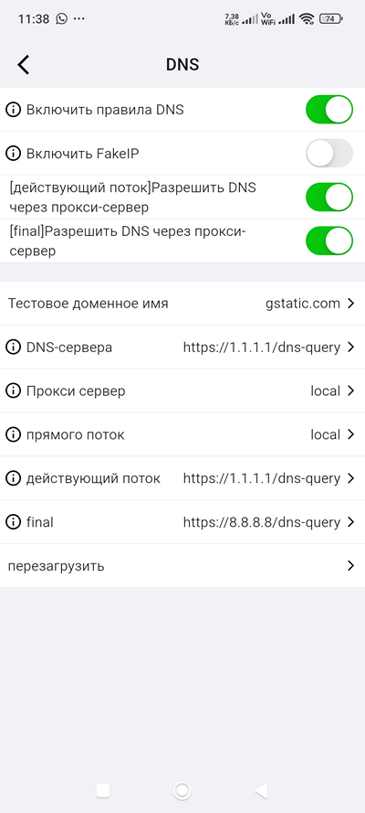
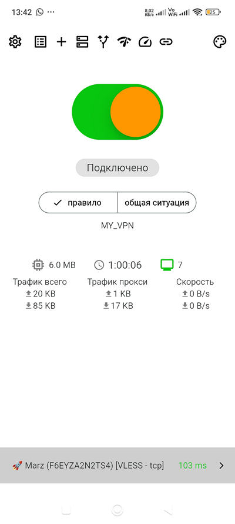

# QuickStart in Russian

## Thanks to Author
- Original author: @Murr_666 (Пупкин Вася), @renixa_tg
- From https://telegra.ph/Karing-06-06
- AND new version in English https://telegra.ph/Karing-07-15


## Karing
Karing - бесплатная мультиплатформенная программа, с открытыми исходниками, представляющая собой мощный и простой набор инструментов proxy. [Официальная страница](/download) (китайский/английский).


Программа недавно разработана китайской фирмой, и в основном предназначена для работы с **подписками VPN** (динамически обновляемый по специальной ссылке список серверов) или "**аэропортами**" - еще более развитой системой динамического предоставления услуг VPN. Понимает форматы подписок - **Clash, V2ray (с пакетом поддержки), Stash, Karing, Sing-box, Shadowsocks, Sub, Github**.

Поддерживает все современные протоколы - **VMess, Vless, Trojan и Shadowsocks (а также многие другие - ShadowsoksR, TUIC, Socks, Http, Hysteria, Hysteria2, WireGuard и др)**. Интерфейс русифицирован. Справка из меню - в основном на китайском, иногда на английском.

Karing также может быть использован и для работы с самостоятельно сформированным списком ключей.

**Совместимость - Android >=10, Windows >=10 x64, iOS >=15, MacOs >=12, TVOS >=17**

[Скачать для Андроид или Windows c GitHub](https://github.com/KaringX/karing/releases)

[Установить для iOS или MacOS](https://apps.apple.com/us/app/karing/id6472431552?platform=iphone)

В разработке: Linux

**Текущая версия** Karing 1.0.23.275 (08.06.24) Ядро - sing-box


##  Быстрый старт
Установите программу. При первом запуске выводится информация о сборе данных:


Соглашаемся и попадаем на второй экран выбора языка интерфейса:


Следующий экран - выбор страны для автоматического применения правил. Очень важно поставить свою страну правильно, поскольку это определяет, какие соединения пойдут через прокси, а какие напрямую. В дальнейшем эту настройку программы можно изменить через Настройки - Правила, или нажав на главном экране значок Установка правил (см. Screen 8) при выключенном соединении.


Следующий экран - добавление профиля. Karing оперирует не отдельными серверами или ключами, а именованными профилями. Каждый профиль может содержать один, или много серверов, или быть подпиской (загружаемый по специальной ссылке меняющийся список серверов, или ключей) или "аэропортом" (совокупность подписок). Внутри профиля можно отключать отдельные сервера, а также включать автовыбор сервера, что очень удобно. Недостаток такой системы - в готовый профиль нельзя добавить сервер (ключ). Так что профиль надо создавать сразу с нужными серверами. Неудачно созданный профиль можно удалить.

Например, вы получили в боте список ключей:


Это сообщение можно копировать даже всё целиком, не обращая внимания на посторонний текст - Karing сам отбросит ненужное, и вставит все ключи. Другой вариант - вы можете самостоятельно вставить ключи, например, в создаваемый в Телеграме пост, и не отправляя его - скопировать всё содержимое в буфер (конечно - можно скопировать и один ключ).


При нажатии "Добавить профиль" программа покажет вам, что находится в буфере обмена. Если всё правильно - дайте название профилю в окошке Примечание, и затем нажмите плюсик в правом верхнем углу - это добавит профиль в программу:


После добавления профиля вы получите сообщение об успехе, и дважды нажав на знак < в левом верхнем углу, попадете обратно в главное окно программы:




Значки управления в верхней строчке слева направо: **Настройка, Профили, Добавить Профиль, DNS, Установка правил, Проверка подключения, Проверка скорости, Ссылка**(настраивается), **Варианты оформления**. Красная точка на значке Настройки - есть обновление.

Слайдер в центре - включение. При первом включении появляется запрос на доступ к VPN - следует разрешить:


Включайте и пользуйтесь!


##   Подробнее о настройках
(к Содержанию)


**Karing**, несмотря на свой "однокнопочный" вид, представляет собой "под капотом" мощный мультиплатформенный комбайн с сотнями возможных настроек и их шаблонов. При реализации на разных платформах разница связана с самими платформами. Так, при установке на Windows на главном экране появляется дополнительный слайдер включения системного прокси.

При установке на Андроид - есть возможность пускать через VPN соединения отдельные приложения, просто пометив их - а в iOS или Macos это невозможно.

Тем не менее, большинство настроек похожи. Если известна специфика на конкретных платформах - это будет указано. По мере появления свежих наблюдений руководство будет пополняться и обновляться.

Сразу настраивать под себя программу необязательно - она хорошо работает и при настройках по умолчанию. Тем не менее, есть большие возможности оптимизации именно под свои задачи - это повышает скорость, удобство и экономит трафик.

**Установка.**

**Windows** - при установке защита ОС запрещает это действие. Нажмите "Показать подробности" - "Выполнить в любом случае" для установки программы. Ограничение - на Win7 программа ставится, но не запускается.

В Windows все настройки хранятся здесь:


**Настройка** - все настройки выполняются при выключенном соединении.


Список возможных точек настройки занимает аж три экрана. Часть из них будет кратко описана.


Screen 11  **Получить трафик**. Это, по сути дела - реклама "аэропортов" по запросу. Например, так:


**Обучение, Часто задаваемые вопросы** - к сожалению, на китайском.

**Часто используемые наборы правил** - ссылка на соответствующую страницу GitHub. Язык английский. Полезна для создания и настройки собственных правил.

**Добавить профиль и Профили** - очевидно. Добавление новых списков и настройка использования существующих. Заметьте, что профиль может отображаться как в свернутом, так и в раскрытом состоянии:


При нажатии трёх точек вверху справа - всплывает дополнительная менюшка.

Значки в меню сверху вниз - **синхронизировать подписку** (если профиль является подпиской), **сортировка профилей, управление конфигурацией (выделено), добавить профиль**


**Управление конфигурацией** - это возможность объединить профили. При нажатии из списка профилей сначала выделите тот, в который надо добавить данные из другого, а следующим шагом - тот, из которого надо добавить.  Для подтверждения слияния надо нажать плохо видимую галочку на самом правом краю экрана вверху (выделено). Эту операцию после подтверждения отменить нельзя.


Второй экран настроек.


**DNS** - важная и полезная точка настроек.

```
DNS - это система серверов, позволяющая превратить символьное имя, например google.com, в его текущий IP-адрес, например 108.177.14.138, который дальше и используется программами для установки связи.
Исходно, все запросы к DNS-серверам отправлялись в нешифрованном виде.
Это, к сожалению, использовалось на первых порах для цензуры запросов, а также слежки.

Так что если вы используете обычные DNS-сервера, любезно предоставленные вам провайдером - провайдер по этим обращениям видит, на какие сайты вы ходите.
К счастью, есть публичные (общедоступные) сервера DNS, поддерживающие шифрованные запросы по технологиям DoH и DoT, и ваша информация становится провайдеру недоступна.
```

Соответственно, в этой точке настройки вы можете выбрать для себя соответствующие сервера с шифрованием.  Возможных вариантов серверов с разными технологиями предлагается аж на 5 экранов.





Рекомендации по настройкам и выбору DNS можно почитать в Интернете. Если вы запутались с настройками DNS и получили неработоспособную конфигурацию - используйте пункт **Перезагрузить**. Это сбросит настройки к начальным.


**Прокси приложения** - это следующая крайне важная точка настройки под себя. Здесь можно и нужно выбрать те приложения на устройстве (это в первую очередь браузеры, а также Instagram, Facebook и тому подобное). Выбранные приложения пойдут через прокси (можете называть VPN), а непомеченные (рекомендуется для мессенджеров и служебных программ) - напрямую. Как минимум, такая настройка сэкономит вам трафик VPN и повысит скорость работы.


Описанная выше настройка применима только для Android. На iOS и MacOS такой функции нет. Нет её и на Windows.


**Правила.** Это очень важное и полезное место. Идея состоит в том, что вы можете очень тонко настроить для себя - что блокировать (например рекламу), что направить напрямую, а что направить через прокси. Именно так, как вы хотите.


```

Вам не нужно, например, набирать или выяснять все относящиеся к делу адреса, а можно использовать специальные имена, каждое из которых может объединять тысячи доменных имен.
Это стало возможным благодаря созданию динамических списков адресов, предоставляемых domain-list-community, и распространяющихся  в виде файлов geosite.dat, включенных в программу и обновляющихся.
Когда при начальной настройке Karing вы выбираете страну - то вы и включаете определение GeoIP зоны ru.
Не надо думать, что это просто все домены заканчивающиеся на .ru - всё значительно хитрее.
При включении этого определения, все не запрещенные сайты идут напрямую, что ускоряет работу, а все запрещенные - через прокси, что обеспечивает их доступность.
При этом все домены, не относящиеся к зоне .ru, идут через прокси.
Как минимальной настройки - этого достаточно.
Однако её можно бесконечно улучшать и усовершенствовать, задавая индивидуальные правила - как на основе предоставляемых программой имён, так и задавая личные правила. Например - имя amazon задает все имена, используемые Амазоном.
Вы можете решить для себя - как с ними поступить.
Например, пустить напрямую, или заблокировать.
Есть такие листы имен и для рекламных сервисов, что позволяет эффективно блокировать рекламу.
Mожно написать свои правила, например, чтобы через прокси шли все обращения к известным нейросетям, и так далее.

```


**Часто используемые наборы правил**  (имён)  - ссылка на соответствующую страницу GitHub. Язык английский. Полезна для создания и настройки собственных правил.

[Немного  о правилах и их применении на примере NekoBox](https://telegra.ph/Marshrutizaciya-v-NekBox-05-29) - читать.


Создание собственных правил:


После создания или видоизменения правил следует зайти в раздел Правила переадресации, и там настроить применение новых правил:


Тема с правилами непростая, и по ней придётся дополнительно читать в Интернете - но оно того стоит. На главной странице есть переключатель Правила - Общая ситуация, позволяющий временно отключить использование правил, вернувшись к настройкам по умолчанию.

** Авто-выбор сервера. (на главном экране)**


Если вы создали профиль (или несколько), который содержит несколько ключей (серверов), Karing старается помочь вам, автоматически выбирая сервер с наименьшей задержкой. Однако не всегда это удобно. Тогда нужное вам поведение настраиваете вручную. Тапните на главном экране (при включенном соединении!) на полоску с надписью Авто-выбор сервера справа.


Здесь вы можете управлять поведением серверов и профилей. Долгий тап на строке сервера позволяет запретить его использование - он будет выделен серым после соответствующего предупреждения. А короткий тап по серверу назначит его использующимся и отключит авто-выбор. Сервер будет выделен голубым, и на главном экране содержимое нижней строки тоже изменится:





На экране видно, что авто-выбор отключен, и для соединения назначен конкретный сервер.

** Дополнительные сервисные функции.**

С главного экрана доступны через значки вверху тестирование соединения:


И измерение текущей скорости соединения:


Также из меню доступны функции бэкапа (сохранения настроек).


## Mascot Karing


[(К началу)](https://telegra.ph/Karing-06-06) [(В меню выбора клиентов)](https://telegra.ph/Vybor-ustanovka-i-nastrojka-VPN-klientov-05-19)


