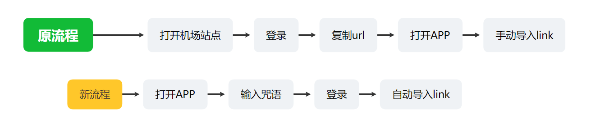

## 物料
- [karing](https://github.com/KaringX/karing/releases/latest) version >= 1.0.37.490
- [karing-connect](https://github.com/KaringX/karing-connect)
  - 包含app接口的二次包装`karing.js`
  - 以及v2board、sspanel的连接案例代码

## 一、演示
### 机场连接到karing
- 以下视频将展示 当机场(服务商/ISP站点) 与karing配置完连接的情况下
- 用户在app上完成登录闭环, 在机场页面登录账号
  - 自动导入配置、自动完成机场信息拉取, 并覆盖原有karing默认配置.

- 视频演示:
-
  <video controls width="320">
    <source src="/videos/v2board-1.mp4" type="video/mp4" />
    您的浏览器不支持 HTML5 视频。
  </video>

### 流程对比
- 对比用户完整使用魔法软件的流程, 采用`karing-connect`方式之后, 将大大简化.
- 尤其是小白用户, 不需要理解订阅与配置，仅需知道 `咒语` 和 `机场账号`

- 


## 二、什么是 karing-connect {#point}
- 用户从karing内置webview容器打开机场(VPN服务商)登录页面, 实现登录即导入配置.

### 完成连接之后的优势
- 用户登录闭环, 一键连接.
- APP内置机场信息
  - 可添加 机场首页、FAQ、客服、社交账号等信息，置顶显示在Karing菜单.
- 功能可配置:
    - 提供**消息推送**功能, 可自定义平台、渠道、版本.
    - 套餐到期**续费提醒**, 可直接点击进入机场产品页.
    - *todo* 机场可根据自身特性定制部分APP默认配置, 比如ipv6、dns等.
- 无附加广告:
    - Karing设置页`专项流量`广告位仅显示该机场链接.
    - **APP内不再露出其他竞品服务**
- 安全:
  - 所有连接使用的代码公开透明, 机场也可自主部署, 根据需求修改.
  - karing不记录+收集任何账号密码.

### 未来可能
- *todo* 机长可修改默认配置及规则
- *todo* 机场专版APP, 自定义logo、名称、配置


## 三、绑定/连接的方法

### 三步走
- 1 通过 https://harry.karing.app/provider 注册并创建服务商
- 2 修改机场代码, 增加连接页面, 比如 `http://v2board.local/karing-connect.html`
  - 载入 `karing.js`
  - 并调用 `_karing`对象的`config`方法导入配置
- 3 在服务商管理后台 添加 `咒语` 和 连接页地址

### 案例连接
- 如果你使用的是 sspanel和v2board比较新的版本, 那么这里已经有两个完整案例供参考:


```mdx-code-block
import DocCard from '@theme/DocCard';

<DocCard
  item={{ type: 'link', label: '🎻案例: 通过V2Board绑定Karing', href: '/cooperation/v2board#spell' }}
/>

<DocCard
  item={{ type: 'link', label: '⛷️案例: SSPanel连接Karing', href: '/cooperation/sspanel#spell' }}
/>
```

### karing-connect 文件说明

```bash
├── karing.js        Karing APP开放接口的二次封装
├── karing.min.js    karing.js的压缩版本, 未做混淆
├── sspanel
│   └── KaringController.php   sspanel案例中新加的控制器
└── v2board
    ├── custom.js              v2board案例中添加的js代码
    └── karing-connect.html    案例连接页面
```

### karing.js 使用示例
- 目前js文件仅提供两个可用地址, 当然、有条件可部署在自己服务器上.
- harry站点: https://harry.karing.app/assets/karing.min.js
- github: https://raw.githubusercontent.com/KaringX/karing-connect/refs/heads/main/karing.min.js

#### 载入方式
1. 修改html
```html
<script src="https://harry.karing.app/assets/karing.min.js"></script>
```
2. js加载
```jsx
// 创建 script 标签
var script = document.createElement('script');
script.src = "https://harry.karing.app/assets/karing.min.js";

// 当脚本加载完成后, 执行某一方法
script.onload = function () {
    something_todo();
};

// 将 script 标签添加到 document 中，开始加载 JS 文件
document.body.appendChild(script);
```


#### 主要方法调用
```jsx

// 预设 PID
(async function () {
    try {
        //参数:
        //  PID 在harry后台创建服务商时 自动分配的id
        //  预设的意义在于预加载配置文件
        //      1.校验配置.
        //      2.减少后续用户等待时间.
        const result = _karing.prepare(PID);
        if (result == '') {
            //3秒自动关闭提示框
            _karing.toast('Successfully prepared, next step...', true, 3);
        }
        else {
            _karing.error('prepare failed, err:', result);
        }
    } catch (error) {
        console.error('Preparation failed:', error);
    }
})();


// 添加karing配置
window.onload = async function () {
    try {
        //参数:
        //  PID置空 app自动读取prepare设置的值
        //  user_nick: 用户昵称
        //  link: 机场订阅链接
        //  link_name: 订阅名称, 可用机场名
        const result = await _karing.config(null, user_nick, link, link_name);
        if (result == '') {
            //3秒自动关闭提示框
            _karing.toast('Import configuration successful, enjoy!', true, 3);
        }
        else {
            _karing.error('config failed, err:', result);
        }
    } catch (error) {
        console.error('Configuration failed:', error);
    }
};


```


## 四、和karing进行合作
- 点击进入👉 [联系方式与合作形式](/blog/isp/cooperation)


