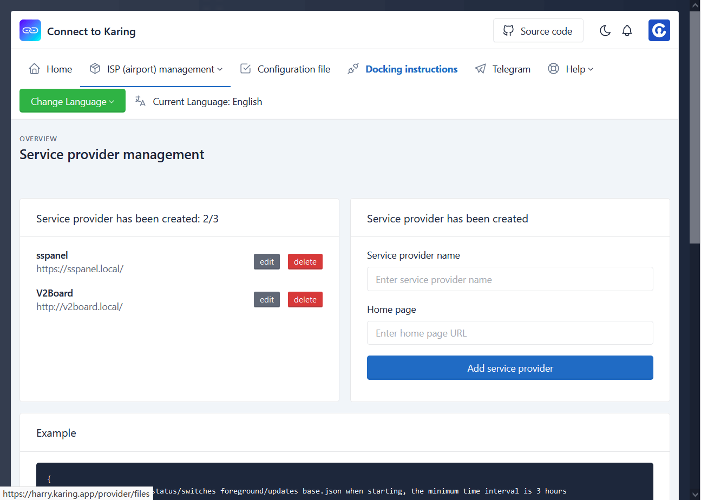
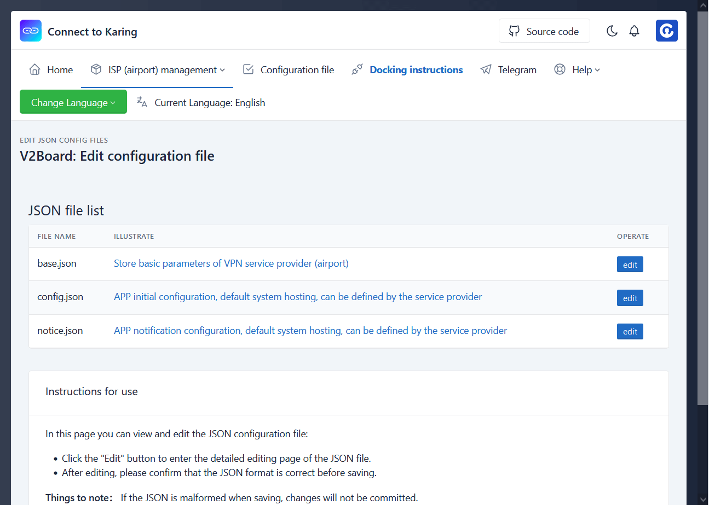

## 说明
- **服务商**: 机场主、机长、VPN提供商、ISP, 以下统称"服务商"
- 注册&登录入口： https://harry.karing.app/auth/login
  - 注册即登录，仅校验邮箱
- 目前仅开放两个功能:
    - 创建/删除 服务商(机场)
    - 服务商(机场) 配置文件修改

## 操作
### 服务商管理
- 登录成功之后, 界面右侧可新建服务商.
- 界面左侧显示当前账号下的服务商列表.
- 点击“编辑/edit” 进入该服务商(机场)的配置文件.
- 点击“删除/delete” 删除该服务商.

- 截图：
- 

### 编辑配置文件
- 罗列当前服务商在Karing APP中会用得到的[配置文件列表](#files)
- 点击“编辑/edit” 进入当前文件的编辑页面, 编辑器 jsoneditor
- 比如 base.json 可修改:
  - 当前服务商 名称、首页 ...
  - karing连接配置 connect、[咒语](./spell.md)列表 spells
  - 其他配置文件地址等
- 点击文件"说明/illustrate"可进入文件的wiki页, 有使用说明、字段注释。

- 截图:
- 

### 限制
- 一个账号可以建立3个服务商(机场/ISP)
- 一个服务商可以创建2个咒语, 建议使用网站名或英语短语

## 配置文件注释 {#files}
- [base.json](./base.json.md)  服务商(机场)基础信息
- [config.json](./config.json.md)  APP配置文件
- [notice.json](./notice.json.md)  APP通知消息

