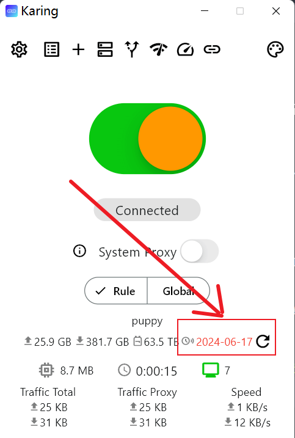
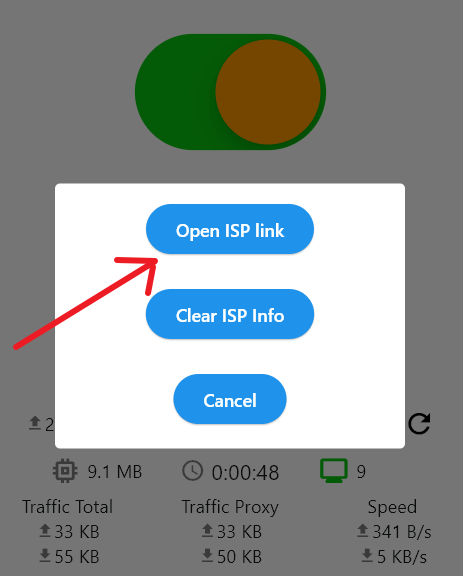

# 集成ISP菜单

## 一、案例
### 设置菜单
- 在karing - 设置菜单 - 顶部显示 `机场名称`、`服务到期时间`、`机场FAQ`
- 用户可点击 `机场名称` 进入机场续费or订购新套餐
- 如下图: 

### 服务到期提醒
- 当用户服务到期时间小于7天, 则显示红字的<font color='red'>到期提示</font>

- 用户可点击 红字的<font color='red'>到期时间</font> 进入机场续费
- 如下图:
  - 
  - 


### 机场管理面板
- 如果您的系统在以下列表中, 请直接看配置步骤
- [SSPanel-Uim](./sspanel.md)
- [V2Board](./v2board.md)


## 二、设置逻辑
- 以下由两种方案, 推荐修改header的方式, 代码侵入比较小。

### 方案1 修改HTTP 标头（header）
- 在订阅链接的 HTTP响应（response）中加入三个*响应标头*
  - (必填) **isp-name**: 您的服务名称(机场名字)
    - 展示在 设置 - ISP - 第一行
  - (必填) **isp-url**: 用户点击isp-name时跳转的URL
  - (可选) *isp-faq*: 您服务的FAQ URL
    - 展示在 设置 - ISP - 第二行
- 修改后, 通过调试工具可显示, 如下图:
  - 

### 方案2 自定义URL Scheme
- karing支持通过scheme唤起karing的`添加配置`页面, 您可把`自动导入karing`的链接改成下面的形式
```html
<a href="karing://install-config?url=xxxx&name=xxx&isp-name=xxx&isp-url=xxx&isp-faq=xxx">自动导入karing</a>
```
- 注意:
  - url 必须通过urlencode转义


### 展示优先级
1. 默认设置 - ISP菜单仅展示一个ISP信息
   - 用户有多个订阅配置的情况下, 按照排序, 展示第一条有有效isp信息
2. scheme的优先级高于header
   - 即首先会展示通过 karing://install-config 设置的isp信息, 如没有,则再判断response header

## 三、和karing进行合作
- 点击进入👉 [联系方式与合作形式](/blog/isp/cooperation)
