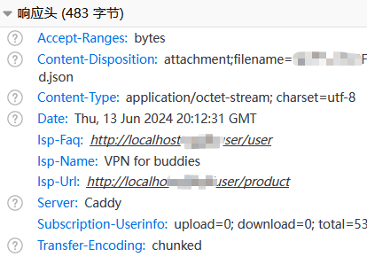
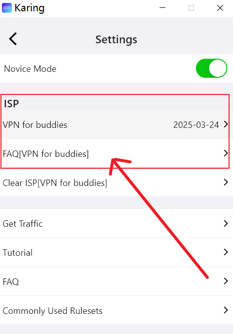

# 修改V2Board与Karing实现互通

## 方案A 通过咒语绑定karing
### 第一步 v2board 系统
- 在v2board目录下增加两个文件
	- custom.js: `public/theme/v2board/assets/custom.js`
	- karing-connect.html: `public/karing-connect.html`
	- *注意* 如果您使用其他主题, 注意替换custom路径中的 `theme/v2board`
- custom会载入一个远程文件 `karing.min.js`
    - 必然也可在GitHub下载原始文件 并自主部署
	- 按自己需求修改更没问题, 原始文件无加密, 未删注释.
	- GitHub: https://github.com/KaringX/karing-connect/blob/main/karing.js

### 第二步 harry.karing 后台
- 修改配置文件 `base.json`
    - *connect* 字段
    - 咒语 *spells* 字段, 推荐使用机场名称.
```js
{
    "pid": 123456,
	...

	"connet": "https://your-domain/karing-connect.html",
    "spells": [
        '急速云',
        'RapidNetwork',
    ],
    ...
}
```

## 方案B 通过订阅链接展示机场信息 {#link}
- **提醒** 如果您已经完成与karing的连接, 比如配置了 `base.json` 文件, 则以下订阅链接的修改并不是必要的.

### 物料
- V2Board: [1.7.4](https://github.com/v2board/v2board/releases/tag/1.7.4)
- 通过添加isp信息 karing会为您:
  - 设置页展示机场信息(入口)
  - 订阅服务到期提醒


### 修改代码
- karing支持clash、clash.meta、v2ray、shadowsocks等订阅格式
  - 这里偷懒, 仅修改`ClientController.php`一个文件

- 文件:
  - app/Http/Controllers/Client/ClientController.php

- 在调用handle并die之前添加三行`isp-`开头的信息

```jsx title="app/Http/Controllers/Client/ClientController.php"
class ClientController extends Controller
{
    public function subscribe(Request $request)
    {
        // ...

        $userService = new UserService();
        if ($userService->isAvailable($user)) {
            $serverService = new ServerService();
            $servers = $serverService->getAvailableServers($user);
            $this->setSubscribeInfoToServers($servers, $user);

            // for karing
            $appName = config('v2board.app_name', 'V2Board');
            $appURL = config('v2board.app_url');
            header("isp-name: " . urlencode($appName));
            header("isp-url: " . urlencode($appURL . '/#/plan'));
            header("isp-faq: " . urlencode($appURL . '/#/knowledge'));

            // ...

            die($class->handle());
        }
    }

```

- **提示**:
  - 代码修改保存之后, 请reload php-fpm进程, 防止opcode缓存影响调试
  - 一定要通过调试工具检查一下 isp-url 和 isp-faq 是您设置的地址
  - 如果app_name包含中文, 必须使用urlencode

### 最终效果
- 调试信息:
  - 

- 设置菜单
  - 

