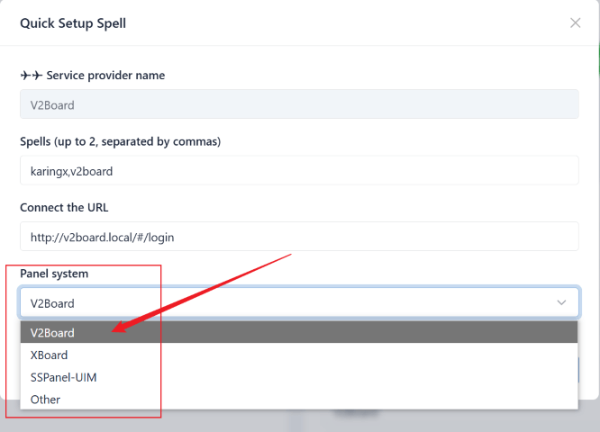
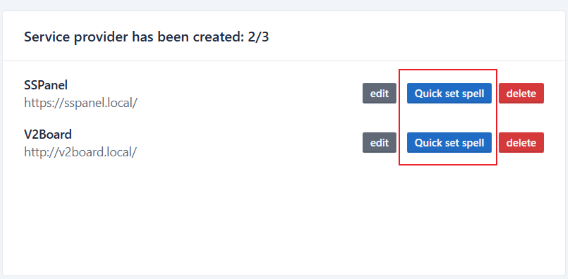
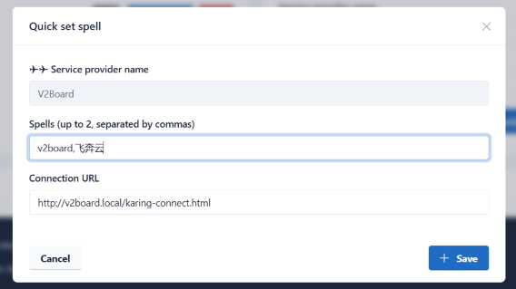

# 修改V2Board与Karing实现互通

### 物料
- V2Board 1.7.4: https://github.com/v2board/v2board/releases/tag/1.7.4
- karing-connect: [https://github.com/KaringX/karing-connect](https://github.com/KaringX/karing-connect/tree/main/v2board)
  - 包含本案例涉及修改的文件

### 视频案例
- 咒语: `v2board`
- 机场连接页: `http://v2board.local/karing-connect.html`
- 演示:
-
  <video controls width="320">
    <source src="/videos/v2board-1.mp4" type="video/mp4" />
    您的浏览器不支持 HTML5 视频。
  </video>


## 方案A 快捷绑定karing {#shortcut}
- karing 已经内置最新版本(>=2024.1)的 sspanel、v2board、xboard 的自动绑定代码, 只要在系统栏选择对应系统即可.
  - 本方案无需修改面板系统, 也无需添加连接页面, `connect`参数填网站登录URL即可.
  - 
- 如果选择了面板系统之后，测试之后，发现无法完成绑定，则可选“Other” 然后尝试**方案B**


## 方案B 通过咒语绑定karing {#spell}

### 思路
- **先叠个甲**: 本人对v2board不熟悉, 非前端, 仅按个人思路做的案例.
  - 如果有更好的方法, 麻烦不吝啬赐教, 提交[connect issue](https://github.com/KaringX/karing-connect/issues) 或联系本人[@elon](https://t.me/ElonWang)
- 首先，karing APP进入一个中间页 `karing-connect.html`
  - 设置cookie `karing=connect` 作为karing连接入口的标记
  - 跳转至 `/#/login`
- 然后, 进入v2board前台页面, 载入自定义js文件 `custom.js`
  - 1 判断是否正在karing webview容器中, 并且存在cookie标记
  - 2 判断当前用户是否登录
  - 3 载入对接js文件 `karing.js`
  - 4 调用后台api `/api/v1/user/getSubscribe` 获取用户信息和订阅链接
  - 5 调用 `_karing` 方法导入用户信息
- 最后, Karing APP 接到信息, 验证并完成机场绑定.


### 第一步 v2board 系统
- 在v2board目录下增加两个文件
	- custom.js: [`public/theme/v2board/assets/custom.js`](https://github.com/KaringX/karing-connect/blob/main/v2board/custom.js)
	- karing-connect.html:  [`public/karing-connect.html`](https://github.com/KaringX/karing-connect/blob/main/v2board/karing-connect.html)
	- *注意* 如果您使用其他主题, 注意替换custom路径中的 `theme/v2board`
  - 最新文件地址:
    	- https://github.com/KaringX/karing-connect/tree/main/v2board

#### custom.js 说明
- custom会载入一个远程文件 `karing.min.js`
  - 也可在GitHub下载原始文件 并自主部署.
  - 除了karing开发的接口名是固定的, 其他皆可按自己需求修改.
  - 原始文件无加密, 未删注释.
    - https://github.com/KaringX/karing-connect/blob/main/karing.js
- 文件中参数 debug 默认false, 设置为true时:
  - 终端打印日志
  - 不判断 window.karing 对象是否存在, 直接模拟走一遍流程
    - 最终会报错: 导入配置失败.


### 第二步 harry.karing.app 后台
#### 方法1 快捷设置咒语
- 进入harry后台, 机场列表, 点击`设置咒语`按钮.
  - 
- 设置咒语和连接url
  - 


#### 方法2 修改配置文件 `base.json`
- *connect* 字段
- 咒语 *spells* 字段, 推荐使用机场名称.
```js
{
    "pid": 123456,
	...

	"connet": "https://your-domain/karing-connect.html",
    "spells": [
        '急速云',
        'RapidNetwork',
    ],
    ...
}
```

### 最后 测试绑定
- Karing APP -> 设置 -> ISP/机场绑定 -> 填入咒语 -> 登录v2board -> 完成绑定


## 方案C 通过订阅链接展示机场信息 {#link}
- **提醒** 如果您已经完成与karing的连接, 比如配置了 `base.json` 文件, 则以下订阅链接的修改并不是必要的.

- 通过添加isp信息 karing会为您:
  - 设置页展示机场信息(入口)
  - 订阅服务到期提醒


### 修改代码
- karing支持clash、clash.meta、v2ray、shadowsocks等订阅格式
  - 这里偷懒, 仅修改`ClientController.php`一个文件

- 文件:
  - app/Http/Controllers/Client/ClientController.php

- 在调用handle并die之前添加三行`isp-`开头的信息

```jsx title="app/Http/Controllers/Client/ClientController.php"
class ClientController extends Controller
{
    public function subscribe(Request $request)
    {
        // ...

        $userService = new UserService();
        if ($userService->isAvailable($user)) {
            $serverService = new ServerService();
            $servers = $serverService->getAvailableServers($user);
            $this->setSubscribeInfoToServers($servers, $user);

            // for karing
            $appName = config('v2board.app_name', 'V2Board');
            $appURL = config('v2board.app_url');
            header("isp-name: " . urlencode($appName));
            header("isp-url: " . urlencode($appURL . '/#/plan'));
            header("isp-faq: " . urlencode($appURL . '/#/knowledge'));

            // ...

            die($class->handle());
        }
    }

```

- **提示**:
  - 代码修改保存之后, 请reload php-fpm进程, 防止opcode缓存影响调试
  - 一定要通过调试工具检查一下 isp-url 和 isp-faq 是您设置的地址
  - 如果app_name包含中文, 必须使用urlencode

### 最终效果
- 调试信息:
  - 

- 设置菜单
  - 

