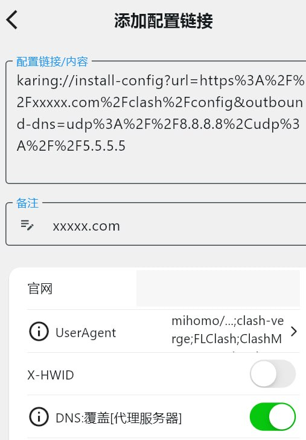

# 机场 FAQ

## Karing如何使用私有DNS？

### 方案1：用户手动设置DNS

:::tip 用户手动设置DNS
- 设置 -> DNS -> 服务器 -> "DNS服务器"/"代理服务器" -> 右上角 "..." 选择 "+ 添加" -> 勾选☑️添加的服务器，取消其他服务器
- 备注1: 添加案例 ISP `Google TLS Server`，URL `tls://8.8.8.8`
- 备注2: DNS -> "代理服务器" 中：如果添加的 dns server 只用来解析代理节点域名，且其他 dns 无其他解析或怕 dns 污染，则一定要取消勾选其他 dns server
:::

### 方案2：使用scheme参数outbound-dns

:::tip 点击导入时即完成 DNS 配置
- 案例如下, 设置代理DNS服务器
  - `karing://install-config?url=https%3A%2F%2Fxxxxx.com%2Fclash%2Fconfig&outbound-dns=udp%3A%2F%2F8.8.8.8%2Cudp%3A%2F%2F5.5.5.5`
  - `clash://install-config?url=https%3A%2F%2Fxxxxx.com%2Fclash%2Fconfig&outbound-dns=udp%3A%2F%2F8.8.8.8%2Cudp%3A%2F%2F5.5.5.5`
- 直接把完整scheme链接填入配置框也可, 如下图
  - 

- ⚠️ karing版本必须>= `v1.2.22.2502`
:::