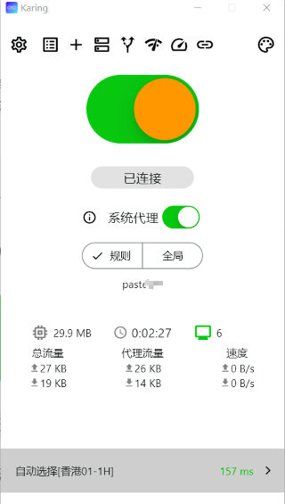
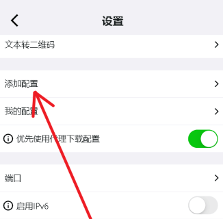
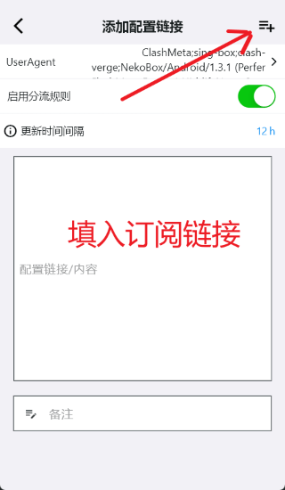
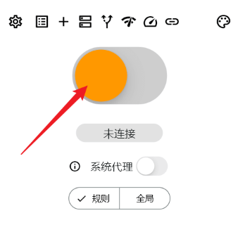
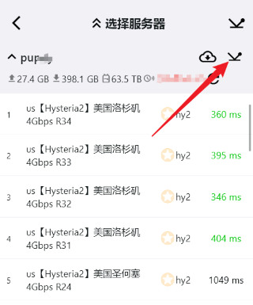

# 快速使用教程
- 这里是Karing官方入门使用教程, 秉承简单实用的原则, 将尽量以简短的表述来说明.

### 主要特性
- 使用简单, 快速上手, 一键起飞
- 支持Clash/Clash.Meta、V2ray(支持批量)、Stash、Sing-box、Shadowsocks、Sub、Github配置链接及配置导入.
- 支持主流协议, 包括 Shadowsocks,ShadowsocksR,VMess, Vless, Trojan, Tuic, Socks, Http, Hysteria, Hysteria2, Wireguard 等.
- 一套路由规则应用于多个订阅源, 自动选择高效节点.
  - 支持自定义路由规则组、节点组.
  - 为小白用户定制默认路由规则组 - 开箱即用.
- 内置支持 魔改版sing-box核心, 性能优越.
- 支持备份和同步, 一次配置多设备同步.
- 增加新手模式 配置更简单.

### 界面预览

## 一、 下载
### iOS(iphone/ipad)/Mac用户
- AppStore(搜索关键词 karing vpn)
    - https://apps.apple.com/us/app/karing/id6472431552
- TestFlight
    - https://testflight.apple.com/join/RLU59OsJ
- 注意: 需要非中国大陆AppStore账号
    - 不会注册?请参考 [苹果ID专卖小店](https://outpost.karing.app/isp?r_c=xda)

### Windows/Android用户
- 下载最新版安装包
    - https://github.com/KaringX/karing/releases/latest
    - Windows 建议下载安装包:文件名规则 karing_xxx_windows_x64.exe(xxx为版本号)
    - 下载后运行安装(如果遇到defender拦截,请点击'显示详细信息' - '仍要运行' 即可安装)
	- Android 下载karing_xxx_android_arm64.apk
- 如果github.com无法访问,也可以[点我下载（需注册）](https://跟斗云.com/user/clients/karing_windows_x64.exe)

### 系统要求
-  Windows >= 10
-  Android >= 10
-  IOS >= 15
-  MacOS >= 12

### 购买价格
- karing 全平台**免费**

:::tip 推广
- 这里收集了一些比较靠谱的收费节点, 请移步 [节点分享](https://outpost.karing.app/isp?r_c=cn)
- 怎么获取免费流量, 请看 [新用户福利](/newuser)
:::

## 二、快速使用/quickstart
1. 点击APP左上角设置按钮 -> 进入 `添加配置`
    - 打开 `添加配置链接`(也可以通过导入或者扫描添加)
      - 
    - 将 Clash/V2ray/SS 等配置链接或者配置内容粘贴到输入框
        - 如果没有配置,可以通过 [新用户福利](/newuser) 申请
    - 点击右上角添加按钮
      - 

2. 返回到主屏
    - 默认已为您选择了一个服务器
        - 点击下方的服务器名称可以重新选择服务器
    - 点击 连接(开关按钮) 即可开始您的网络之旅了
        - 

### 如何选择更快的服务器
- 点击主屏下方的服务器名称后，打开 '选择服务器'
- 点击 '延时检测' 按钮
  - 
- 稍等一会后, 每个服务器后面会展示对应服务器延时
    - 延时数值越低越好
    - 三角提示的表示有错误,服务器可能无法使用,点击后可以查看具体错误信息
- 选择一个延时数值低的服务器即可
- 建议使用 `自动选择` 服务器功能

## 三、进阶功能
- 👉[内置分流规则集](../tutorial/diversion.md)
- 👉[自定义分流规则、节点组](../tutorial/custom-diversion.md)
- 👉[应用入站代理(Android)](../tutorial/perapp-proxy.md)
- 👉[备份和多端同步配置](../tutorial/backup-sync.md)

## 最后、常见问题/FAQ
- 我把karing装入U盘随身携带？ 👉[便携配置(Windows)](../tutorial/portable.md)
- 我是ISP(机场主)
  - 怎么在karing上集成我的套餐链接? 👉[ISP集成](../cooperation/menu.md)
  - 一键导入karing配置的快速链接怎么写? 👉[scheme格式](../cooperation/scheme.md)

- 其他问题请移步 [FAQ](/faq/)

