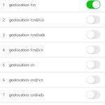

# 快速使用教程

- 这里是Karing官方入门使用教程, 秉承简单实用的原则, 将尽量以简短的表述来说明.
- Karing是一个强大易用的代理工具, 支持clash、v2ray、ss、sing-box订阅链接。


## 一、 界面预览


### 主要特性
- 使用简单,快速上手,一键起飞
- Sing-box内核,性能优越
- 支持Clash,V2ray(支持批量),Stash,Karing,Sing-box,Shadowsocks,Sub,Github配置链接及配置导入

## 二、 下载
### 下载安装
#### iOS(iphone/ipad)/Mac用户
- AppStore(搜索关键词 karing vpn)
    - https://apps.apple.com/us/app/karing/id6472431552
- TestFlight
    - https://testflight.apple.com/join/RLU59OsJ
- 注意: 需要非中国大陆AppStore账号
    - 不会注册?请参考 [苹果ID专卖小店](https://outpost.karing.app/isp?r_c=xda)

#### Windows/Android用户
- 下载最新版安装包
    - https://github.com/KaringX/karing/releases/latest
    - Windows 建议下载安装包:文件名规则 karing_xxx_windows_x64.exe(xxx为版本号)
    - 下载后运行安装(如果遇到defender拦截,请点击'显示详细信息' - '仍要运行' 即可安装)
	- Android 下载karing_xxx_android_arm64.apk
- 如果github.com无法访问,也可以[点我下载](https://跟斗云.com/user/clients/karing_windows_x64.exe)

#### 系统要求
-  Windows >= 10
-  Android >= 10
-  IOS >= 15
-  MacOS >= 12

### 购买价格
- 免费

## 三、科学节点
- 收费或自建节点, 请移步 [节点分享](/blog/isp/node-share)
- 新人礼及免费流量, 请移步 [新用户福利](/newuser)

## 四、快速使用/quickstart
1. 点击APP左上角设置按钮
    - 打开 添加配置链接(也可以通过导入或者扫描添加)
      - 
    - 将 Clash/V2ray/SS 等配置链接或者配置内容粘贴到输入框
        - 如果没有配置,可以通过 [新用户福利](/newuser) 申请
    - 点击右上角添加按钮


2. 返回到主屏
    - 默认已为您选择了一个服务器
        - 点击下方的服务器名称可以重新选择服务器
    - 点击 连接(开关按钮) 即可开始您的网络之旅了
        - 

#### 如何选择更快的服务器
- 点击主屏下方的服务器名称后，打开 '选择服务器'
- 点击 '延时检测' 按钮
  - 
- 稍等一会后, 每个服务器后面会展示对应服务器延时
    - 延时数值越低越好
    - 三角提示的表示有错误,服务器可能无法使用,点击后可以查看具体错误信息
- 选择一个延时数值低的服务器即可
- 建议使用 [自动选择] 服务器功能


### 策略/分流
- 目前已支持并且可以手动修改的策略有两类:机场自带策略和app内置的GeoSite, 机场自带策略需要在添加配置的时候开启 启用路由组策略 开关;GeoSite需要在App内先启用对应的规则组,启用方法参考 [GeoSite] 开启
- 更改策略: 设置-路由组策略: 可以根据您的需求设置不同组对应的节点服务器
  - 
- GeoSite 数据库目前主要服务CN地区,其他地区用户可以不启用此功能
- [GeoSite] 开启
  - 
- 如何开启GeoSite规则?
  - 设置 - GeoSite里搜索规则名称, 点击开关打开
- GeoSite 规则说明:(仅针对cn地区用户)
  - 名称中带有!cn, 说明该规则里的站点在cn地区无法正常访问,需要通过代理服务器
  - 名称中带有cn(无!), 说明该规则里的站点在cn地区可以正常访问,不需要代理, 设置为直连
  - 对于cn地区的用户,建议手动开启geolocation-!cn,并且在路由组策略中设置为'自动选择服务器' 或 手动指定服务器


### 自定义分流
 - 升级到最新版本(>=1.0.15.133)
 - 添加分流组: 设置 - 分流 - 自定义分流组 - 添加一个分流组,添加后会自动返回到 自定义分流组, 点击刚才添加的组,编辑分流组内容,内容格式可点击对应的输入框后查看格式示例,每行一条, 添加完毕后点击右上角保存
 - 添加 连接状态 里的信息到分流组: 主屏 - 连接状态 - 点击需要设置的项 - 选择要设置的类型 - 选择之前创建的自定义分流组, 数据会自动填充到规则组里, 如果已有,则不重复添加, 添加完毕后点击右上角保存
 - 设置分流规则: 设置 - 分流 - 分流规则, 找到刚才添加分流组并选中, 点击右侧选择分流节点,返回主屏, 设置生效, app会自动重新连接
 - 注意: 规则中所有数据都大小写敏感
 - 名词解释: Domain Suffix: 域名后缀,比如ads.google.com,api.google.com具有相同的域名后缀.google.com, 只要域名后缀和.google.com即命中规则; Domain: 完整域名, 必须完全匹配才会命中规则; Domain Keyword :域名关键词, 只要域名中有指定的关键词即命中规则,比如ads.google.com, ad.google.cn都有google关键词; IP Cidr: IP段, 如果是匹配某个ip,那么/后应该为完整掩码;Process Name:windows 进程名称; Process Path:windows进程完整路径; App Package: android应用包id

### 应用入站代理[Android]
- 用于设置哪些App可以使用VPN,如果没有选中任何app,则系统所有app的流量都会通过VPN, 如果选中了:白名单模式只有选中的app的流量才会走VPN,黑名单模式只有没有选中的app的流量才会走VPN
- 例子: 比如你现在所在地区为中国大陆(CN), 当你使用youtube, twitter, facebook, telegram等需要VPN的app时候,你只需要将这些app在应用入站代理中勾选(白名单模式), 一般还要将系统浏览器勾选上,这样只有你勾选的这些app会使用VPN代理,其他未勾选app的不受VPN影响
- 好处: 降低VPN app耗电,以及避免分流设置问题导致app无法上网或者网速慢的问题
- 强烈建议使用此功能

### Scheme(Windows下需要到设置-系统Scheme里开启才能生效)
```js
- clash://install-config?url=xxxx&name=xxx      添加配置(xxx为urlencode后的参数)
- karing://install-config?url=xxxx&name=xxx&isp-name=xxx&isp-faq=xxx&isp-url=xxx     添加配置(xxx为urlencode后的参数)
- karing://connect      打开连接
- karing://disconnect   断开连接
- karing://reconnect    重新连接
```

### ISP开放
- isp-name: isp(机场等)名称,展示在设置-第一行[必填]
- isp-url: 用户点击isp-name时候会跳转到isp-url[必填]
- isp-faq: isp自定义FAQ URL,展示在设置-第二行,用户点击会跳转到对应的URL
- isp-name,isp-faq,isp-url设置有两种方式:
  - 订阅请求返回的http头分开添加上述三个属性
  - karing://install-config?url=xxxx&name=xxx&isp-name=xxx&isp-faq=xxx&isp-url=xxx(xxx为urlencode后的参数)
- 展示优先级:
  - 通过 karing://install-config 设置的isp信息,如果没有,则继续
  - 按照用户订阅配置排序,找到第一条有有效isp信息的配置并展示

### 便携配置(Windows)
- karing.exe添加启动参数--enable_portable_path, karing.exe将会使用exe所在目录创建配置文件目录,而不是使用系统的相关目录,方便把karing放到USB随身携带


## 最后、常见问题
### 支持哪些代理协议？
- 支持主流的 Shadowsocks,ShadowsocksR,VMess, Vless, Trojan, Tuic, Socks, Http, Hysteria, Hysteria2, Wireguard 等代理协议


### FAQ
- 其他问题请移步 [FAQ](/faq/)


