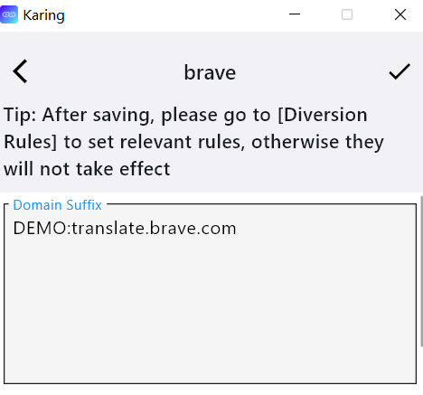
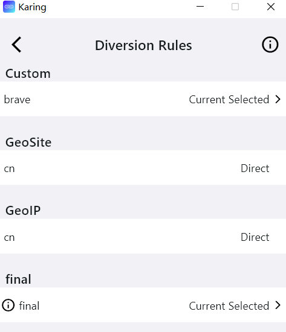
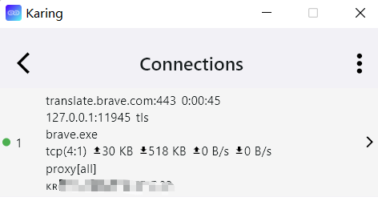

# 自定义分流
- 如果内置的 geo(-ip、-site)和ACL规则还不能满足你的需求，那么可以尝试 `自定义分流组` 和 `自定义代理组`

## 物料
- karing >= 1.0.15.133
- Brave 1.67.116
  - 仅限以下案例使用

## 自定义分流组
- 这里用该功能 *解决brave翻译功能在大陆无法使用的问题* 来举例。

### 配置步骤
1. 添加分流组
  - 设置 —> 分流 -> `自定义分流组` -> 右上角➕号, 添加一个分流组, 写上备注 brave
2. 添加规则
  - 返回 `自定义分流组` 列表, 选择刚才的 备注名
  - 填入需要的规则, 以brave举例:
    - `Domain Suffix` 处填入 "translate.brave.com"
    - 左上角✔保存
    - 

3. 选择规则匹配动作
  - 设置 —> 分流 -> `分流组规则` ->  第一屏 自定义组下，选择 brave(刚才规则的备注名)
  - 选择动作 **当前选择**
    - 
4. 返回karing首页, 重连使设置生效
  - 关闭"连接"按钮, 再打开连接, 此时按钮背景为绿色
5. 测试下是否可以
  - brave浏览器打开一个页面，右键 -> 翻译
  - karing首页 -> 连接（💻图标）
    - 

**注意**: 规则中所有数据都大小写敏感

### 名词解释
:::tip 名词解释
Domain Suffix: 域名后缀
  - 比如ads.google.com,api.google.com具有相同的域名后缀.google.com,
  - 只要域名后缀和.google.com即命中规则;

Domain: 完整域名
  - 必须完全匹配才会命中规则

Domain Keyword :域名关键词
  - 只要域名中有指定的关键词即命中规则
  - 比如ads.google.com, ad.google.cn都有google关键词;

IP Cidr: IP段
  - 如果是匹配某个ip,那么/后应该为完整掩码;

Process Name: windows 进程名称

Process Path: windows进程完整路径

App Package: android应用包id
:::

## 自定义代理组
- 步骤与分流组类似, 暂不赘述

