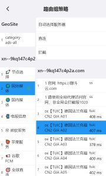
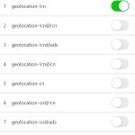

# 策略和分流

## 概述
- 目前已支持并且可以手动修改的策略有两类:机场自带策略和app内置的GeoSite, 机场自带策略需要在添加配置的时候开启 启用路由组策略 开关;GeoSite需要在App内先启用对应的规则组,启用方法参考 [GeoSite] 开启
- 更改策略: 设置-路由组策略: 可以根据您的需求设置不同组对应的节点服务器
  - 
- GeoSite 数据库目前主要服务CN地区,其他地区用户可以不启用此功能
- [GeoSite] 开启
  - 
- 如何开启GeoSite规则?
  - 设置 - GeoSite里搜索规则名称, 点击开关打开
- GeoSite 规则说明:(仅针对cn地区用户)
  - 名称中带有!cn, 说明该规则里的站点在cn地区无法正常访问,需要通过代理服务器
  - 名称中带有cn(无!), 说明该规则里的站点在cn地区可以正常访问,不需要代理, 设置为直连
  - 对于cn地区的用户,建议手动开启geolocation-!cn,并且在路由组策略中设置为'自动选择服务器' 或 手动指定服务器

## 内置规则集

## 案例
- [docker加速器](/blog/case/docker)
- [屏蔽广告](/blog/case/banad)

## 其他分流功能
- [下一课 自定义分流](/tutorial/custom-diversion)
- [Android 分应用分流](/tutorial/perapp-proxy)

