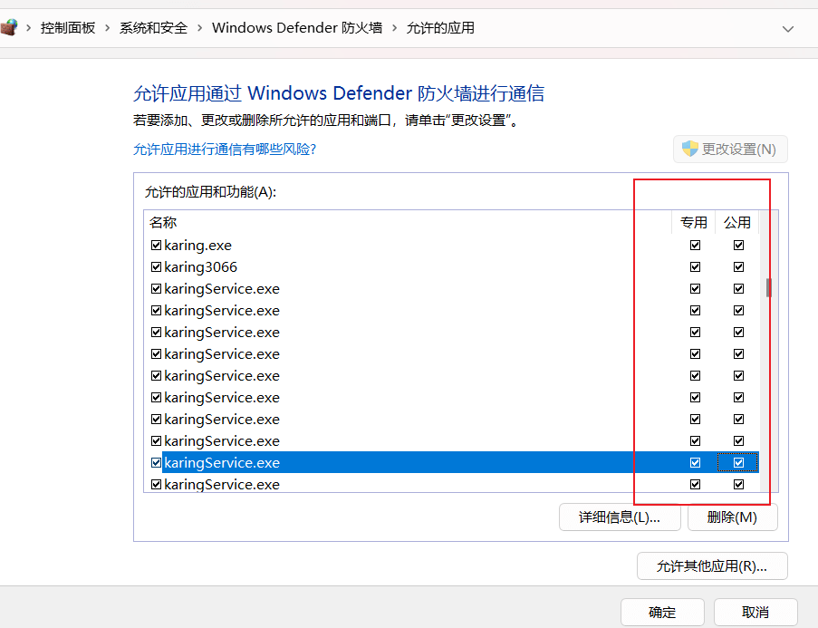
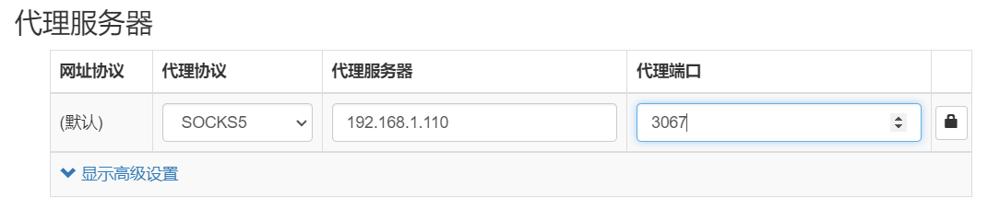

# 使用karing为局域网其他设备提供代理服务
- 为局域网(同一网段)内其他设备提供 socks/http 代理

## 物料
- 系统: windows11
- karing: 1.0.24.283

## 允许karing通过Windows Defender防火墙
- 进入windows`控制面板` -> `Windows Defender 防火墙` -> `允许应用通过 Windows 防火墙`
  - karing应用对应的 `专用`和`公用`选项都勾选上。
  - 当然，如果你能明确区分你的网络是`专用`和`公用`的, 那么仅勾选必要的即可。

- 如下图:
  - 

### Tips
- 如何查看当前网络类型:
  - `控制面板` –> `网络和 Internet` –> `查看网络状态和任务`

- 参考案例: [windows防火墙设置](../../blog/case/wsl2#windows防火墙设置)

## karing 设置
- `设置` -> 关闭 `新手模式`
- 设置 -> 网络共享 -> 打开 `允许其他主机接入`
  - 顺手查看 `网络接口` 得到当前IP地址, 比如: **192.168.1.x**
- `设置` -> `端口` -> 得到当前开放端口, 默认如下：
  - 基于规则 **3067**
  - 全直连 **3065** (方便调试)
  - 全代理 **3066**

### 其他设备设置代理
- kairng采用混合代理模式, 即socks/http/https协议均支持
- 如上一步所得:
  - 基于规则的链接: `socks5://192.168.1.110:3067`
  - 全走代理的链接: `socks5://192.168.1.110:3066`
  - **本机应用**链接: `socks5://127.0.0.1:3067`

- 配置proxy截图:
  - 

