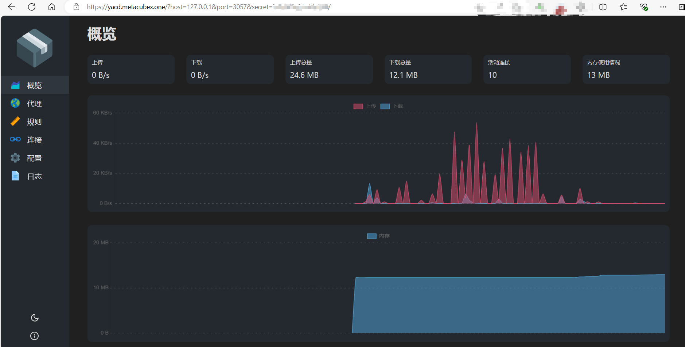
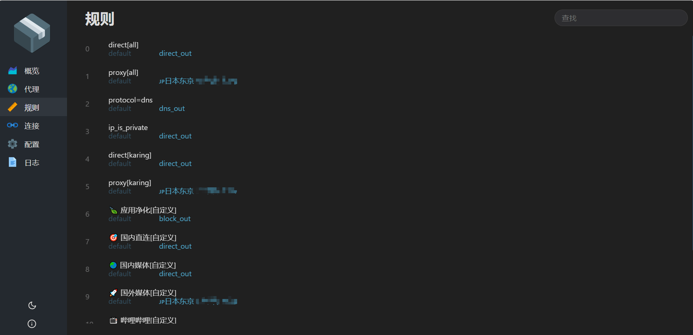

---

---

# 在线面板
- 便于不习惯karing UI界面，但喜欢传统clash式界面的小伙伴使用.

- **MetaCubeXD** https://metacubexd.pages.dev/#/setup
- **zashboard** https://board.zash.run.place/#/setup

## 使用APP集成面板
- 设置 -> `在线面板` -> 自动唤起默认浏览器打开yacd界面
- URL: `http://127.0.0.1/?hostname=127.0.0.1&port=3057&secret=xxxx`

### 默认IP及端口
- hostname: 127.0.0.1
- port: 3057
- secret: 可在配置文件 `service_core.json` 中获取

### 截图
  - 
  - 

