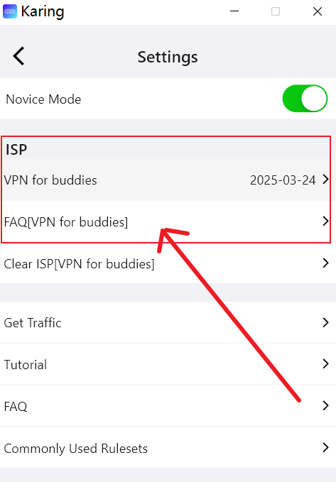
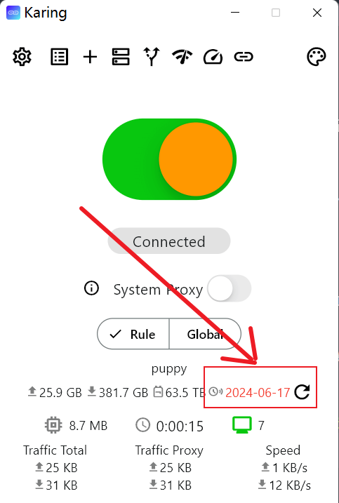
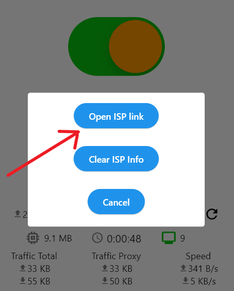
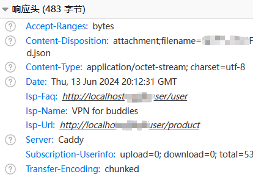

# Integrating ISP Menu

## 1. Examples

### Setting Menu

- In karing - Settings Menu - Display `Service Name`, `Service Expiration Time`, `Service FAQ` at the top
- Users can click `Service Name` to renew or purchase a new package
- As shown below:
  - 

### Expiration Reminder

- When the user's service expiration time is less than 7 days, a <font color='red'>Expiration Reminder</font> will be displayed in red

- Users can click the red <font color='red'>expiration time</font> to renew the service
- As shown below:
  - 
  - 


### Service Management Panel

- If your system is listed below, please refer to the configuration steps directly
- [SSPanel-Uim](/cooperation/sspanel)
- [V2Board](/cooperation/v2board)

## 2. Setting Logic

- There are two solutions below, it is recommended to modify the header method as it has minimal code intrusion.

### Solution 1: Modify HTTP Headers

- Add three *response headers* in the HTTP response of the subscription link
  - (Required) **isp-name**: Your service name (vpn name)
    - Displayed in Settings - ISP - First line
    - If the isp name contains non ASCII characters, URL-encoded must be used
  - (Required) **isp-url**: The URL to which users are redirected when they click on isp-name
  - (Optional) **isp-faq**: The FAQ URL of your service
    - Displayed in Settings - ISP - Second line
- After modification, it can be displayed through debugging tools, as shown below:
  - 

### Solution 2: Custom URL Scheme

- Karing supports invoking the `Add Configuration` page of karing through the scheme. You can change the `import to karing` link as follows
```html
<a href="karing://install-config?url=xxxx&name=xxx&isp-name=xxx&isp-url=xxx&isp-faq=xxx">import to karing</a>
```
- Note:
  - URL must be URL-encoded

### Display Priority

1. Default Settings - The ISP menu displays only one ISP information
   - When a user has multiple subscription configurations, the first valid ISP information will be displayed according to the order
2. The priority of the scheme is higher than the header
   - The isp information set through karing://install-config will be displayed first, if not, then the response header will be checked

## 3. Cooperate with karing
- Click here to enter 👉 [Contact and Cooperation Forms](/en/blog/isp/cooperation#for-vpn-providers-from-other-regions)
