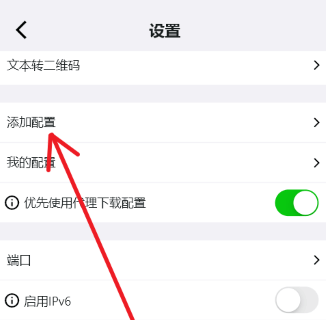
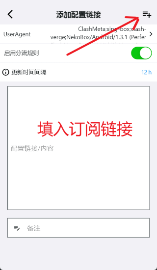
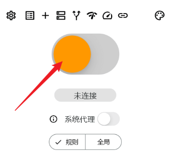
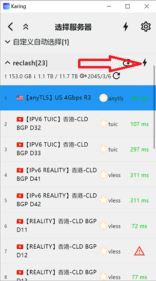

# Quick Start Guide
- Here is Karing's official tutorial. Adhering to the principle of simplicity and practicality, it will be explained as briefly as possible.

### Main Features
- Easy to use, quick to get started, one-click to take off
- Support Clash/Clash.Meta, V2ray (support batch), Stash, Sing-box, Shadowsocks, Sub, Github configuration link and configuration import.
- Support mainstream protocols, including Shadowsocks, ShadowsocksR, VMess, Vless, Trojan, Tuic, Socks, Http, Hysteria, Hysteria2, Wireguard, etc.
- A set of routing rules is applied to multiple subscription sources, automatically selecting efficient nodes.
- Support custom routing rule groups and node groups.
- Customize the default routing rule group for novice users - Out of the box.
- Built-in support for the modified sing-box core, excellent performance.
- Support backup and synchronization, configure multiple devices at once.
- Added novice mode for easier configuration.

### Interface preview

## System requirements
- IOS >= 15
- MacOS >= 12
- TvOS >= 17
- Android >= 8
- Windows >= 10

## 1. Download
### iOS(iphone/ipad)/tvOS(appleTV)
- AppStore(search keyword karing vpn)
- https://apps.apple.com/us/app/karing/id6472431552
- TestFlight
- https://testflight.apple.com/join/RLU59OsJ
- Note: A non-mainland China AppStore account is required
- Don't know how to register? Please refer to [Apple ID Store](https://dot.karing.app/pi.html?r_c=xda)

### Other platform
- [Download](../download)

### Purchase price
- karing **free** on all platforms

:::tip promotion
- Here are some reliable paid nodes, please go to [Node Sharing](https://dot.karing.app/pi.html?r_c=cn)
- How to get free traffic, please see [New User Benefits](/newuser)
:::

## 2. Quick use/quickstart
1. Click the settings button in the upper left corner of the APP -> Enter `Add Configuration`
- Open `Add Configuration Link` (can also be added by importing or scanning)
- 
- Paste the configuration link or configuration content of Clash/V2ray/SS into the input box
- If there is no configuration, you can apply for it through [New User Benefits](/newuser)
- Click the add button in the upper right corner
- 

2. Return to the main screen
- A server has been selected for you by default
- Click the server name below to reselect the server
- Click Connect (switch button) to start your network journey
- 

### How to choose a faster server
- Click the server name at the bottom of the main screen to open 'Select Server'
- Click the 'Delay Detection' button
- 
- After a while, the corresponding server delay will be displayed behind each server
- The lower the delay value, the better
- The triangle prompt indicates an error and the server may not be available. Click to view the specific error message
- Select a server with a low delay value
- It is recommended to use the `Auto Select` server function

### How to use the Apple TV (tvos) version
- Download and install Apple TV (tvos) and mobile Karing
- Mobile installation of the above process [1] Add configuration
- Open Apple TV Karing
- Use a mobile device with Karing installed to scan Apple QR code of Karing on TV
- After scanning the connection successfully, Karing on mobile will enter the Apple TV control center
- Click the [Upload] button in the upper right corner to synchronize the core configuration (after synchronization, Karing on Apple TV will have an additional [Connect] button)
- Go back to Karing on Apple TV and enable the connection
- After Karing on Apple TV is successfully connected, you can view relevant status information in the Karing on mobile Apple TV control center

## 3. Advanced functions
- 👉[Built-in diversion rule set](../tutorial/diversion.md)
- 👉[Custom diversion rules, node groups](../tutorial/custom-diversion.md)
- 👉[Application inbound proxy (Android)](../tutorial/perapp-proxy.md)
- 👉[Backup and multi-end synchronization configuration](../tutorial/backup-sync.md)

## Finally, FAQ
- I put karing into a USB drive and carry it with me? 👉[Portable Configuration (Windows)](../tutorial/portable.md)
- I am an ISP (airport owner)
- How do I integrate my package link on karing? 👉[ISP Integration](../cooperation/menu.md)
- How do I write a quick link to import karing configuration with one click? 👉[scheme format](../cooperation/scheme.md)
- For other questions, please go to [FAQ](/faq/)