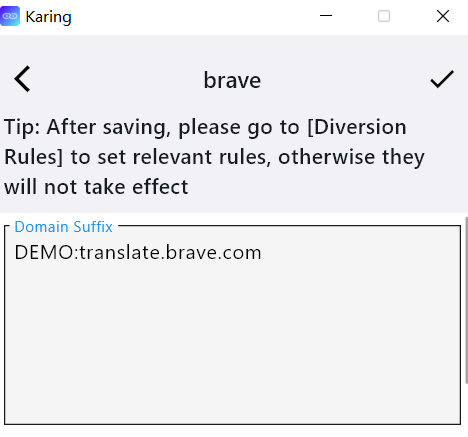
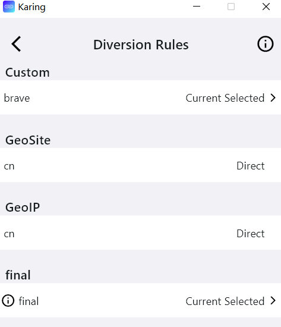
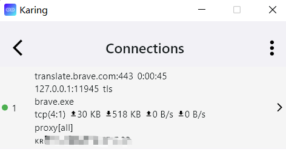

# Custom diversion
- If the built-in geo(-ip, -site) and ACL rules cannot meet your needs, you can try `Custom diversion group` and `Custom proxy group/Custom Auto Select`

## Materials
- karing >= 1.0.15.133
- Brave 1.67.116
- Only used in the following cases

## Custom diversion group
- Here we use this function *to solve the problem that Brave translation function cannot be used in mainland China* as an example.

### Configuration steps
1. Add a diversion group
- Settings —> Diversion -> Diversion rules -> Edit -> `Custom diversion group` -> ➕ in the upper right corner -> Click the first ➕, add a diversion group, and write a note brave
2. Add rules
- Return to the `Custom diversion group` list, select the note name just now
- Fill in the required rules, taking brave as an example:
- Fill in "translate.brave.com" in `Domain Suffix`, Note: Do not have `DEMO:` characters
- Save in the upper left corner
- 

3. Select the rule matching action
- Return to the first screen of diversion rules, under the custom group, select brave (the note name of the rule just now)
- Select the action **Current selection**
- 
4. Return to the karing homepage and reconnect to make the settings effective
- Close the "Connect" button, then open the connection, the button background is green
5. Test if it works
- Open a page in brave browser, right click -> Translate
- Karing homepage -> Connection (💻 icon)
- 

**Note**: All data in the rule are case sensitive

### Glossary
:::tip Glossary
Domain Suffix: Domain name suffix
- For example, ads.google.com and api.google.com have the same domain name suffix .google.com,
- As long as the domain name suffix and .google.com are hit, the rule is hit;

Domain: Full domain name
- Must be fully matched to hit the rule

Domain Keyword: Domain name keyword
- As long as the domain name has the specified keyword, the rule is hit
- For example, ads.google.com and ad.google.cn both have the keyword google;

IP Cidr: IP segment
- If it is to match a certain ip, then the / should be followed by a complete mask;

Rule Set: Remote rule set
- Supports srs and json formats
- Note: For rules on github, please use the Raw button on the page to obtain the file download address

Rule Set (build-in): Built-in rule set (geosite, geoip, acl)

Process Name: Windows process name

Process Path: Windows process full path

App Package: Android application package id
:::

## Custom proxy group/Custom Auto Select
- The steps are similar to the diversion group, so I will not repeat them