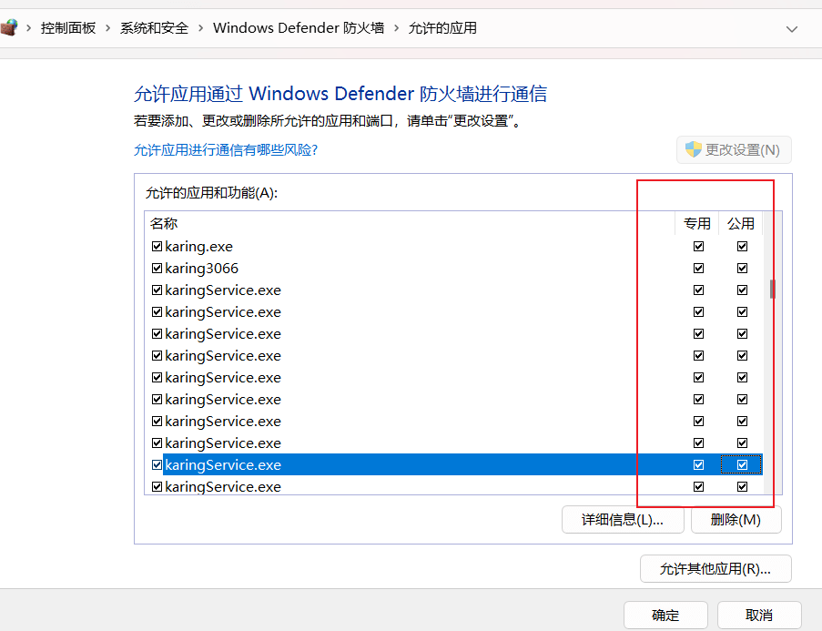
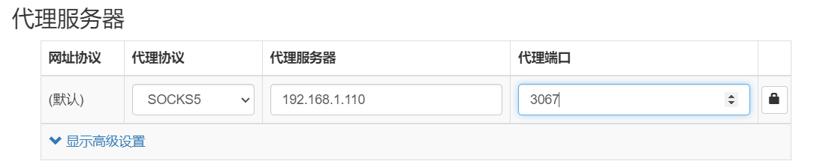

# Using karing to Provide Proxy Services for Other Devices on the LAN
- Provide socks/http proxy for other devices on the same LAN (same subnet)

## Materials
- System: Windows 11
- karing: 1.0.24.283

## Allow karing Through Windows Defender Firewall
- Go to Windows `Control Panel` -> `Windows Defender Firewall` -> `Allow an app through Windows Firewall`
  - Check both `Private` and `Public` options for the karing application.
  - Of course, if you can clearly distinguish between your network being `Private` and `Public`, you can only check the necessary one.

- As shown below:
  - 

### Tips
- How to check the current network type:
  - `Control Panel` -> `Network and Internet` -> `View network status and tasks`

- Reference Case: [Windows Firewall Settings](../../blog/case/wsl2#windows防火墙设置)

## karing Settings
- `Settings` -> Disable `Novice Mode`
- `Settings` -> `Network Sharing` -> Enable `Allow Others to Connect`
  - Note the `Net Interfaces` to get the current IP address, e.g., **192.168.1.x**
- `Settings` -> `Port` -> Get the current open ports, default as follows:
  - Rule-based **3067**
  - Direct-All **3065** (for debugging)
  - Proxy-All **3066**

### Setting Proxy on Other Devices
- karing uses a hybrid proxy mode, supporting socks/http/https protocols
- As obtained in the previous step:
  - Rule-based link: `socks5://192.168.1.110:3067`
  - Proxy-ALL link: `socks5://192.168.1.110:3066`
  - **Local application** link: `socks5://127.0.0.1:3067`

- Proxy configuration screenshot:
  - 

