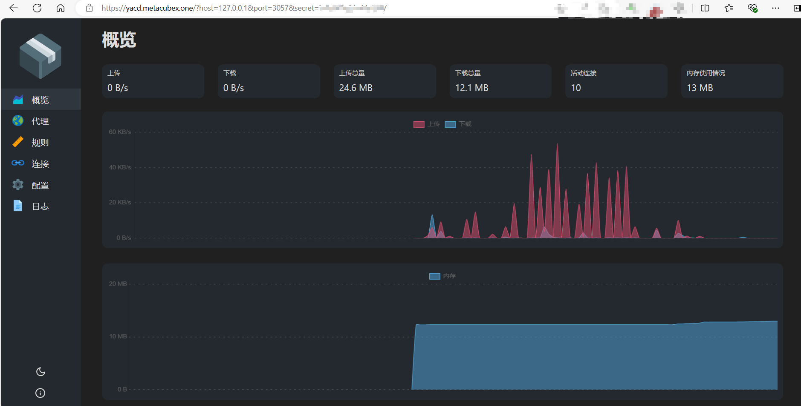
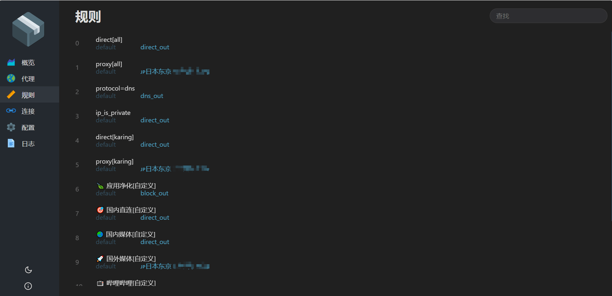

---

---

# Online panel
- For those who are not used to the karing UI interface but like the traditional clash interface.

## Usage
- Settings -> `Online panel` -> Automatically wake up the default browser to open the yacd interface
- URL: `https://yacd.haishan.me/?hostname=127.0.0.1&port=3057&secret=xxxx`

### Default IP and port
- hostname: 127.0.0.1
- port: 3057
- secret: can be obtained in the configuration file `service_core.json`

### Screenshots
- 
- 