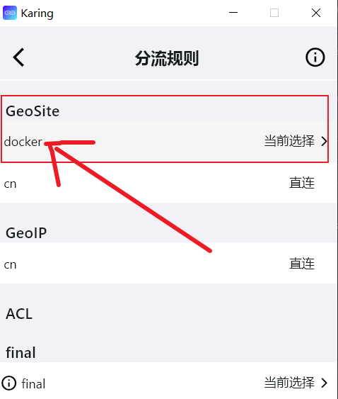
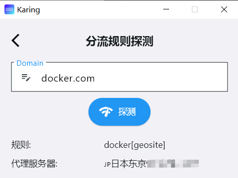
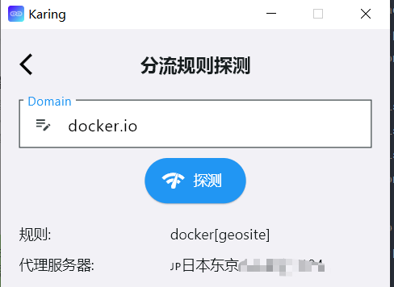
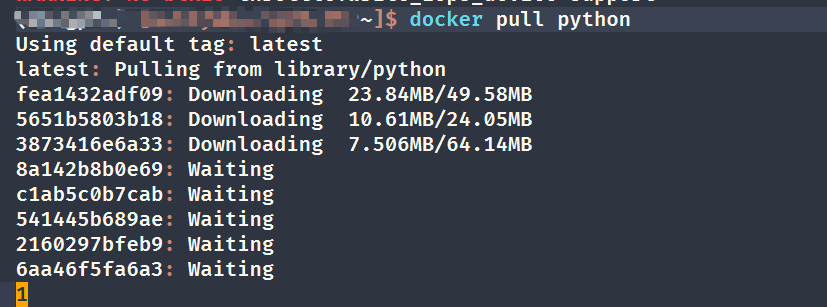
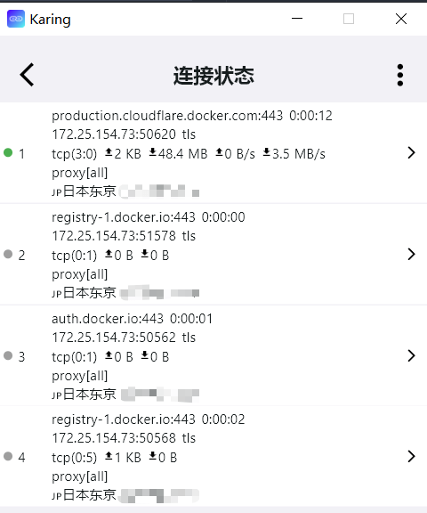

# Создание Docker-ускорителя через Karing

- Из-за некоторых _непреодолимых обстоятельств_ большинство Docker registry mirror-сервисов в Китае сейчас недоступны. Часто рекомендуют поднимать собственный mirror или использовать CF Workers mirror.
- Здесь показан более прямой способ: пустить Docker через proxy и обойти блокировку.

## Материалы

- Docker Engine: 26.1.3
- Karing: [1.0.24.283](https://github.com/KaringX/karing/releases/tag/v1.0.24-283)

## Шаги

- В этом примере используется изменение `/etc/docker/daemon.json`; это самый простой способ.
- Способ с изменением переменных окружения systemd можно взять напрямую из официальной инструкции: [Configure the Docker daemon to use a proxy server](https://docs.docker.com/config/daemon/systemd/?highlight=proxy#httphttps-proxy).

### 1. Создайте пользовательский маршрут, если нужно

- Этот шаг можно пропустить: в Karing по умолчанию есть правило `geoip/cn`, и не-китайские IP автоматически пойдут через proxy.
- Но можно, как в примере, создать отдельный маршрут для Docker-доменов.

#### Создание пользовательского правила

- 1. Настройки -> Разделение трафика -> _Правила разделения_ -> кнопка редактирования справа вверху (значок ✏)
  - -> Пользовательская группа разделения -> кнопка ➕ справа вверху -> примечание `docker`
  - -> В списке правил выберите _docker_
  - -> Прокрутите до встроенных правил `Rule Set(build-in)`
  - Найдите и выберите `geosite:docker`
  - Нажмите √ справа вверху для сохранения

- 2. Настройки -> Разделение трафика -> `Правила разделения` -> `docker` -> измените действие на **Текущий выбор**.
  - 

#### Проверка

- Настройки -> Разделение трафика -> в самом низу `Проверка правил разделения`
  - Проверьте _docker.com_ и _docker.io_.
- Как на скриншотах:
  - 
  - 

### 2. Получите IP-адрес и порт proxy Karing

- Настройки -> Общий доступ к сети -> включите `Разрешить доступ другим хостам`.
  - Заодно посмотрите `Сетевой интерфейс`, чтобы получить текущий IP-адрес, например **172.25.83.1**.
- Настройки -> `Порты` -> получите текущий открытый порт, по умолчанию:
  - Полностью через proxy **3066**

- См. также: [Общий доступ к портам](/tutorial/lan#karing-настройки)

### 3. Добавьте proxy-конфигурацию Docker

- Файл: `/etc/docker/daemon.json`
  - Измените файл, заменив IP/Port на свои:
  ```jsx title="/etc/docker/daemon.json"
  {
     "proxies": {
          "http-proxy": "socks5://172.25.83.1:3066",
          "https-proxy": "socks5://172.25.83.1:3066"
      }
  }
  ```
- Перезапустите Docker daemon:

```bash
$sudo systemctl daemon-reload
$sudo systemctl restart docker
```

- Проверьте переменные:

```jsx
$docker info

...
 Debug Mode: false
 HTTP Proxy: socks5://172.25.83.1:3066
 HTTPS Proxy: socks5://172.25.83.1:3066
...

```

### 4. Загрузите последний образ Python

- `docker pull python`
  - 
- Проверьте журнал подключений в Karing:
  - 
- Готово, можно продолжать работу.

## Дополнительно

### Частая ошибка при настройке proxy для Docker-сервиса

- Docker images управляются Docker daemon.
  - Популярный способ с изменением shell environment variables здесь не работает.
  - В старых версиях Docker нужно было менять environment variables systemd, а в новых версиях >=23.0 можно использовать `daemon.json`.
  - Конфигурация клиента `~/.docker/config.json` также не влияет на загрузку images.
- По той же причине использовать proxy через _proxychains_ не получится.

### Собственный Docker registry mirror

- [CRProxy (Container Registry Proxy)](https://github.com/wzshiming/crproxy/blob/master/examples/default/README.md)
