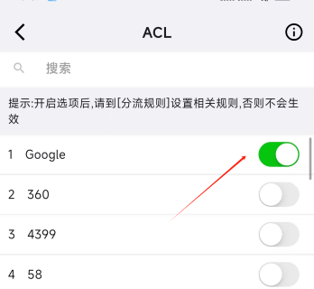
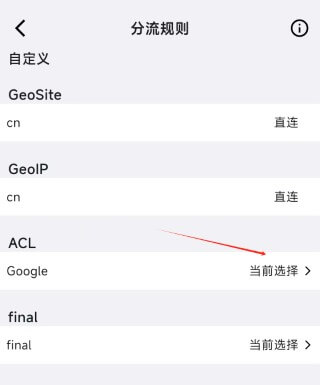
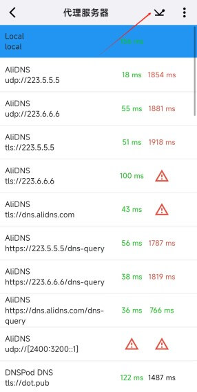
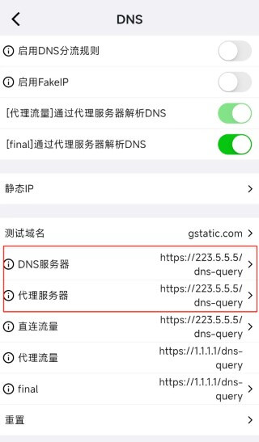
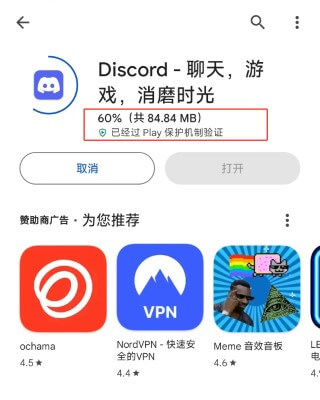
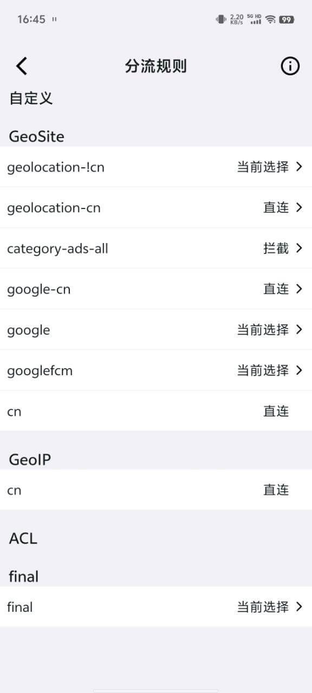
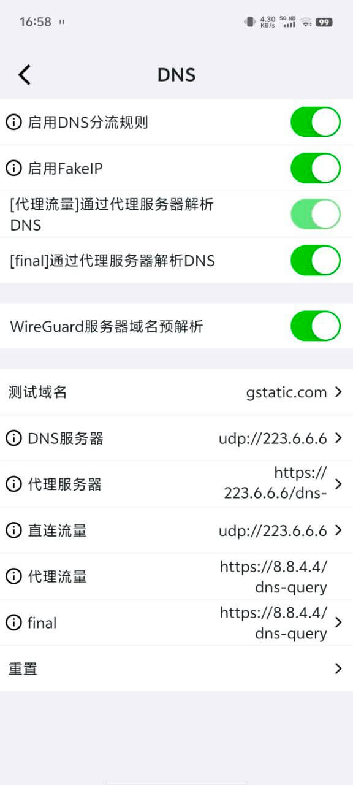

# Решение проблемы, когда Google Play не скачивает или не обновляет приложения

- Иногда приложения в Play Store отображаются нормально, но не скачиваются и не обновляются.
- Обычно причины сводятся к нескольким пунктам:
  - CDN-домены загрузки Google Play не входят в правила разделения трафика.
  - DNS ошибочно разрешает домены в китайские IP.
  - Proxy-узел не может разрешить или подключиться к нужным доменам Play Store.

## Настройка Karing

- Идея: сначала определить домены, которые использует Play Store, затем изменить соответствующие правила разделения трафика и настроить правильный DNS.

### Домены Google Play Store

```jsx
doamin:googleapis.cn
doamin:googleapis.com
doamin:xn--ngstr-lra8j.com
```

### Правила разделения трафика

- Используйте правило `acl:Google`. Список доменов можно сверить с файлом [Google.json](https://github.com/KaringX/karing-ruleset/blob/sing/ACL4SSR/Ruleset/Google.json).
- Шаги настройки:
  - **Включить правило**: Karing -> Настройки -> Разделение трафика -> _Правила разделения_ -> кнопка редактирования справа вверху (значок ✏)
    - -> Пользовательская группа разделения -> кнопка ➕ справа вверху -> примечание `google play`
    - -> В списке правил выберите _google play_
    - -> Прокрутите до встроенных правил `Rule Set(build-in)`
    - Найдите и выберите `acl:Google`
    - Нажмите √ справа вверху для сохранения
  - **Задать действие**: Разделение трафика -> Правила разделения -> `google play` -> _Текущий выбор_.

- Как на скриншотах:
  - 
  - 

### DNS

- Шаги настройки:
  - **Проверить доступные DNS**: Karing -> Настройки -> DNS -> DNS-серверы -> справа вверху _DNS speed test_.
  - **Настроить DNS**: DNS -> DNS-серверы, proxy-серверы -> выберите самый быстрый DNS server из результатов теста.
- Как на скриншотах:
  - 
  - 

### Использование Play Store

- 

## Другой вариант

- Этот вариант был опубликован активным пользователем [@William Wu] в [группе Karing](https://t.me/KaringApp). Спасибо!
- Идея:
  - Настройки разделения трафика
    - `geosite:geolocation-!cn`: не-китайские домены -> _Текущий выбор_
    - `geosite:google-cn`: _Прямое подключение_
    - `geosite:google`: _Текущий выбор_
  - Затем настроить правильный DNS.
- См. скриншоты ниже:
  - 
  - 
