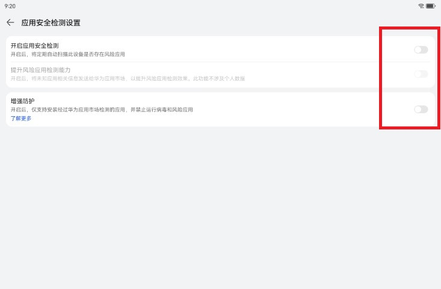
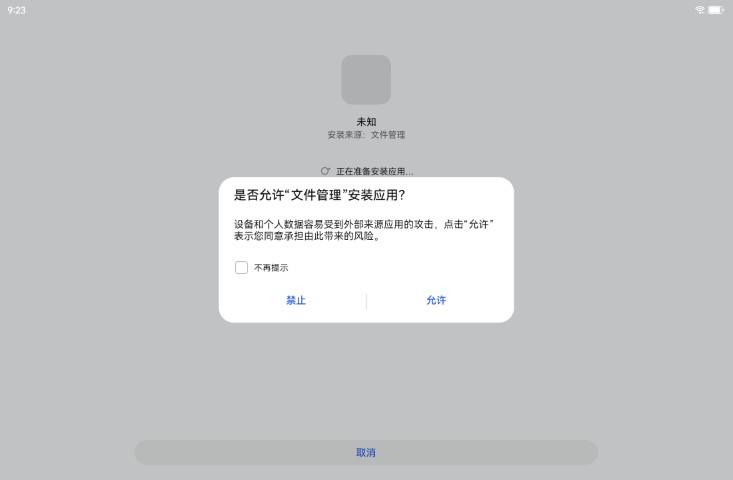
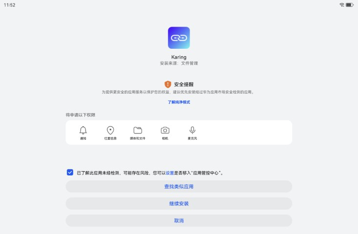
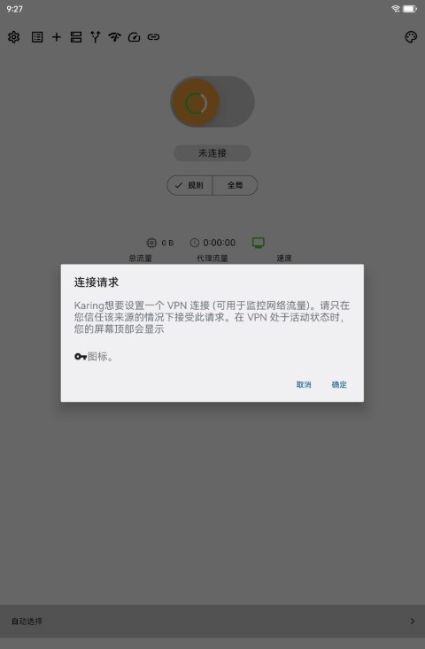

# Установка proxy-приложения Karing на Huawei HarmonyOS

## Материалы

- HarmonyOS:
  - HarmonyOS 4.2.0
- Karing:
  - [karing_1.0.23.275_android_arm64.apk](https://github.com/KaringX/karing/releases/download/v1.0.23-275/karing_1.0.23.275_android_arm64.apk)
- Ссылка подписки на proxy-узлы

## Шаги

### 1. Отключите настройки безопасности HarmonyOS

- Откройте Huawei AppGallery, перейдите в `Я` -> Проверка безопасности приложений -> значок настроек **справа вверху**.
  - Отключите `Проверку безопасности приложений`.
  - Отключите `Enhanced Protection`.
  - Как на скриншоте: 
- Ещё один путь к `Enhanced Protection`: Настройки -> Система и обновления -> Pure Mode.

### 2. Установите Karing

- Скачайте APK Karing в память устройства. Если GitHub недоступен, используйте стороннее облачное хранилище как промежуточный способ, например Baidu Netdisk или Alibaba Cloud Drive.
- Откройте системный `Файловый менеджер`, нажмите на APK и разрешите установку приложения.
  - Как на скриншоте: 
- При появлении `Предупреждения безопасности` отметьте `Я понимаю риск этого приложения` и нажмите **Продолжить установку**.
  - Как на скриншоте: 

### 3. Настройте Karing

- После установки откройте Karing, добавьте конфигурацию и вставьте подготовленную `ссылку подписки на узлы`.
- Вернитесь на главную страницу Karing, нажмите `Подключиться` и разрешите `запрос на подключение`.
  - Как на скриншоте: 

### 4. Обработка ошибок

#### Ошибка online rules

- При первом подключении может появиться ошибка, похожая на timeout при скачивании **geo-ip/geo-site**.
  - Это происходит потому, что до подключения proxy ядро sing-box не может скачать online rules.
- Решение:
  - В Karing есть встроенные правила разделения; сначала отключите правила провайдера.
  - Действие: Настройки -> Разделение трафика -> `Отключить правила разделения ISP`.
  - Переподключение: вернитесь на главную страницу и нажмите кнопку подключения.
