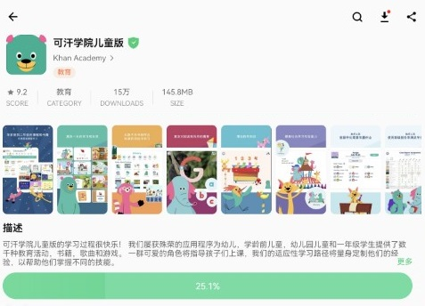
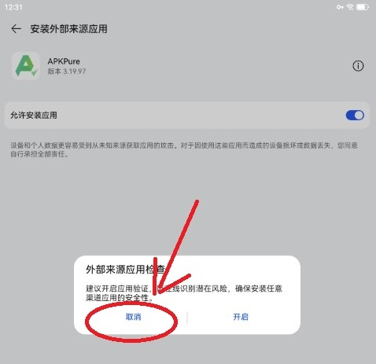
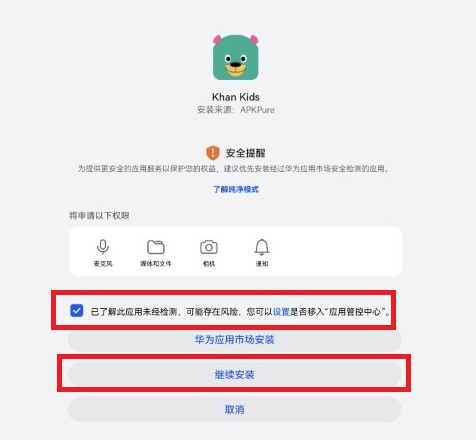
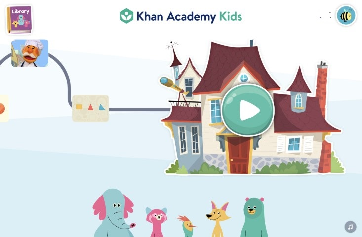

# Установка Khan Academy Kids на HarmonyOS

## О Khan Academy Kids

- Я пробовал несколько китайских и зарубежных детских обучающих приложений. Среди бесплатных вариантов Khan Academy Kids — лучший: он строит персональный учебный маршрут на основе результатов ребёнка в каждом activity.
- В приложении есть английский для начинающих, математика, чтение, логика и другие курсы. По сути, это можно сравнить с полноценным набором обучающих приложений.
- При этом одноимённые приложения в китайских магазинах часто оказываются рекламными подделками.
- Ниже показано, как установить Khan Kids на HarmonyOS.

## Материалы

- HarmonyOS:
  - HarmonyOS 4.2.0
- APKPure:
  - [APKPure_v3.19.97_apkpure.com_1109.apk](https://apkpure.com/apkpure/com.apkpure.aegon/download/3.19.99?utm_content=1006&icn=aegon&ici=text_home-m&from=text_home-m)

## Шаги

### 1. Установите APKPure

- Отключение настроек безопасности HarmonyOS и установка APKPure выполняются так же, как в предыдущей статье, поэтому здесь не повторяются.
  - Быстрая ссылка: [Установка Karing на HarmonyOS](/blog/case/harmonyos#шаги)

- Сначала откройте Karing и включите proxy-подключение, иначе APKPure не сможет работать.

### 2. Установите Khan Academy Kids

- 1. Введите `Khan Academy Kids` в поиске APKPure.
  - Откройте страницу нужной версии и нажмите **Download**.
    - 
- 2. После скачивания нажмите установить и разрешите APKPure `устанавливать внешние приложения`.
  - Важно: **отключите** `проверку безопасности внешних приложений`. 
- 3. Отметьте `Понимаю предупреждение безопасности` и продолжите установку. 
- Установка завершена.

### 3. Использование

- В большинстве случаев Khan Kids после установки работает нормально. Но иногда всё равно требуется proxy/VPN.
  - Лучше всего использовать вместе с [Karing](/).

- Интерфейс приложения: 
