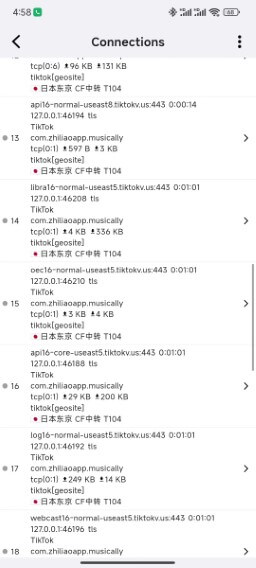
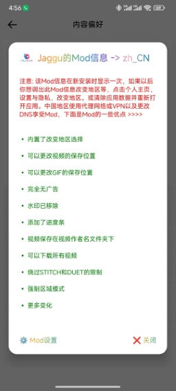
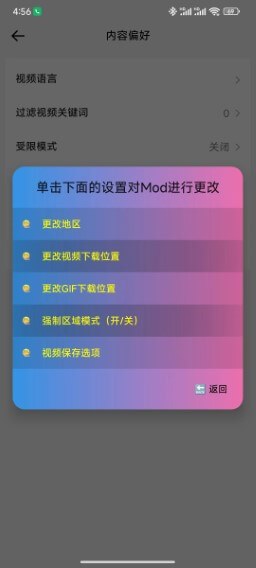

# Проксирование трафика TikTok на Android через Karing

## TikTok: скачивание, блокировка рекламы и разблокировка региона без извлечения SIM

- Ссылка для скачивания Android-версии: https://t.me/tiktalktik
  - Это модифицированная версия международного TikTok от индийского разработчика.

:::tip Информация о моде Jaggu
Для использования в Китае нужен proxy/VPN или изменение DNS. Некоторые преимущества мода:

- Встроенный выбор региона
- Можно изменить место сохранения видео
- Можно изменить место сохранения GIF, рекламы нет
- Водяной знак удалён
- Добавлена полоса прогресса
- Можно скачивать все видео
- Видео сохраняются в папку с именем автора
- Обход ограничений STITCH и DUET, принудительный региональный режим

:::

### Инструкция

- Здесь используются встроенные GeoSite-правила Karing. Конечно, лучше использовать [режим proxy по приложениям](#режим-proxy-по-приложениям).
  - В этом примере правила разделения используются, чтобы направить трафик TikTok через узел _Япония_.

### Шаги настройки

1. Скачайте APK через [Telegram](https://t.me/tiktalktik)
   - В примере используется файл _TikTok_31.7.3_v8a.apk_.
2. Установите APK
   - Если используется Huawei HarmonyOS, работа не гарантируется. Способ установки см. здесь: [Установка Karing на HarmonyOS](/blog/case/harmonyos).
3. Настройте разделение трафика в Karing
   - **Включить правило**: Karing -> Настройки -> Разделение трафика -> _Правила разделения_ -> кнопка редактирования справа вверху (значок ✏)
     - -> Пользовательская группа разделения -> кнопка ➕ справа вверху -> примечание `tiktok`
     - -> В списке правил выберите _tiktok_
     - -> Прокрутите до встроенных правил `Rule Set(build-in)`
     - Найдите и выберите `geosite:tiktok`
     - Нажмите √ справа вверху для сохранения
   - **Задать действие**: Разделение трафика -> Правила разделения -> `tiktok` -> выберите **японский узел** (в примере регион аккаунта — Япония)
     - Также можно использовать **Текущий выбор**.

   - Вернитесь на главную страницу Karing и переподключитесь.

4. Откройте TikTok
   - Обычный просмотр
     - 

   - Проверьте состояние подключений Karing
     - 

## Режим proxy по приложениям

- Шаги настройки см. в [Proxy по приложениям](/tutorial/perapp-proxy).
- Karing -> Настройки -> TUN -> Proxy по приложениям -> включите "Включить", отметьте "Режим белого списка", найдите и отметьте `TikTok`.
- Вернитесь на главную страницу Karing и переподключитесь.

## Информация о моде Jaggu

