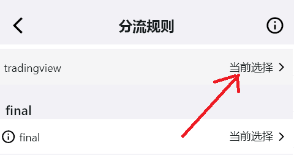

# Доступ к TradingView через пользовательское правило разделения трафика

- Пользователям, занимающимся инвестициями, TradingView хорошо знаком. Это удобный инструмент, но `cn.tradingview.com` недоступен из материкового Китая.
- Раньше при использовании Clash for Windows (CFW) пользовательские правила сохраняли через `parsers`, иначе при каждом обновлении подписки провайдера они перезаписывались и терялись.
- В этом примере доступ к TradingView настраивается через простое пользовательское правило разделения трафика в **Karing**.

## Шаги настройки

1. Добавьте группу разделения трафика

- Настройки -> Разделение трафика -> `Пользовательская группа разделения` -> кнопка ➕ справа вверху. Добавьте группу и укажите примечание `tradingview`.

2. Добавьте правило

- Вернитесь к списку `Пользовательская группа разделения` и выберите созданное имя.
- Добавьте нужное правило для TradingView:
  - В поле `Domain Suffix` укажите `.tradingview.com`.
  - Нажмите ✔ слева вверху, чтобы сохранить.

3. Выберите действие для совпавшего правила

- Настройки -> Разделение трафика -> `Правила группы разделения` -> в пользовательской группе на первом экране выберите `tradingview`.
- Выберите действие **Текущий выбор** или нужный узел.
  - 

4. Вернитесь на главную страницу Karing и переподключитесь, чтобы настройки вступили в силу

- Отключите кнопку "Подключение", затем включите её снова. Фон кнопки станет зелёным.

5. Проверьте работу

- Настройки -> Разделение трафика -> внизу `Проверка правил разделения` -> введите `cn.tradingview.com`.
  - 
- Откройте TradingView в браузере.
