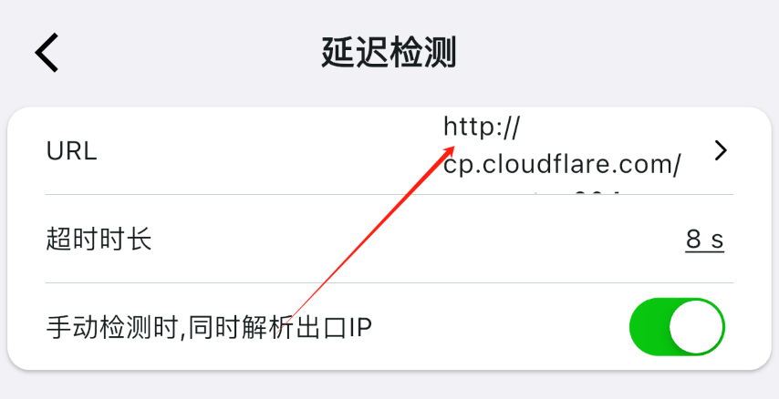
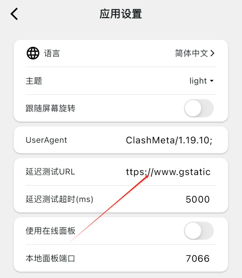

## Почему

- Иногда проверка задержки в Karing/Clash, то есть connectivity test или ping, выполняется очень медленно или завершается тайм-аутом. Сброс DNS при этом может не помогать.
  - Также это проявляется как **узел работает, но отображается восклицательный знак и connection timeout**.
- Причина в том, что у некоторых провайдерских узлов из-за локальных DNS-настроек получается неправильный IP для `www.gstatic.com`.
  - А стандартный адрес `url-test` во многих приложениях — *http://www.gstatic.com/generate_204*.
- В такой ситуации самый простой способ — заменить адрес проверки на другой.

## Как заменить

### Karing

- Настройки -> Проверка задержки -> URL
- 

### ClashMi

- Настройки приложения -> URL проверки задержки
- 

## Список URL для url-test

- **Примечание**: лучше выбрать провайдера, отличного от исходного адреса.
- Список:

| Провайдер  | Ссылка                                                                                                 | Ответ (HTTP CODE)          |
| ---------- | ------------------------------------------------------------------------------------------------------ | -------------------------- |
| Google     | [http://www.gstatic.com/generate_204](http://www.gstatic.com/generate_204)                             | 204                        |
| Google     | [http://www.google-analytics.com/generate_204](http://www.google-analytics.com/generate_204)           | 204                        |
| Google     | [http://www.google.com/generate_204](http://www.google.com/generate_204)                               | 204                        |
| Google     | [http://connectivitycheck.gstatic.com/generate_204](http://connectivitycheck.gstatic.com/generate_204) | 204                        |
| Apple      | http://captive.apple.com                                                                               | 200 Success                |
| Apple      | https://www.apple.com/library/test/success.html                                                        | 200 Success                |
| Microsoft  | http://www.msftconnecttest.com/connecttest.txt                                                         | 200 Microsoft Connect Test |
| Cloudflare | http://cp.cloudflare.com/generate_204                                                                  | 204                        |
| Firefox    | [http://detectportal.firefox.com/success.txt](http://detectportal.firefox.com/success.txt)             | 200 success                |
