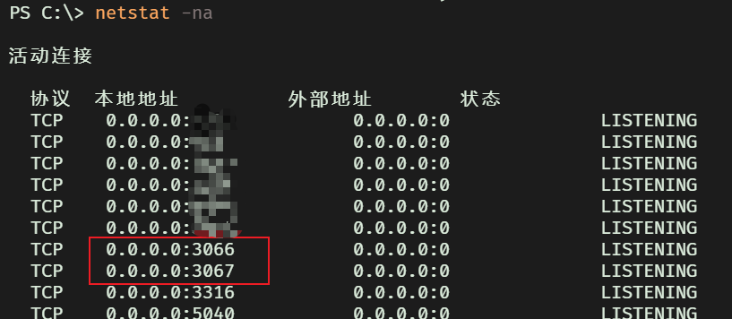

# Использование proxy-порта Karing в WSL2

## Настройки Karing

- 1. Настройки -> Общий доступ к сети -> Разрешить доступ другим хостам
- 2. Настройки -> Порты
  - По правилам, по умолчанию **3067**
  - Полностью через proxy, по умолчанию **3066**
- 3. Вернитесь на главную страницу и нажмите кнопку подключения

- 4. Проверьте открытые порты Windows, если нужно

```bash
netstat -na
```

    

## Проверка доступности порта из WSL2

- 1. Получите host IP
  - Способ A: Karing -> Настройки -> Сетевой интерфейс
    - IP интерфейса vEthernet(WSL)
  - Способ B: WSL2 -> посмотреть `nameserver` в `resolv.conf`

  ```bash
  grep nameserver /etc/resolv.conf  | awk -F ' ' '{print $2}'
  ```

- 2. Проверьте подключение
  - Допустим, host IP: _172.31.160.1_
  - Допустим, WSL2 использует сетевой режим NAT по умолчанию

```bash
$ telnet 172.31.160.1 3066
Trying 172.31.160.1...
Connected to 172.31.160.1.
Escape character is '^]'.

```

- Если появилось _Connected_, подключение успешно и порт можно использовать
- Если появился _time out_, скорее всего проблема в firewall Windows

## Настройка firewall Windows {#windows-firewall}

### Шаг 1. Очистите правила, связанные с Karing

- Меню Пуск Windows -> Панель управления -> Система и безопасность -> Firewall Windows / Просмотр состояния firewall -> Дополнительные параметры (левая панель) -> **Правила для входящих подключений**
- Отсортируйте правила по имени и удалите все правила, начинающиеся с **karing**

### Шаг 2. Создайте новое правило

#### Вариант A: по порту

- Действия (правая панель) -> Правила для входящих подключений / Создать правило -> Порт -> TCP / Определённые локальные порты _3066_ -> Разрешить подключение -> Выберите все профили сети -> Имя -> Готово

#### Вариант B: по программе

- Действия (правая панель) -> Правила для входящих подключений / Создать правило -> Программа -> Укажите абсолютный путь к _karingService.exe_ -> Разрешить подключение -> Выберите все профили сети -> Имя -> Готово

После создания правила снова переключитесь в WSL2 и проверьте подключение через telnet.

## proxychains-ng

- 1. Установите
  - Arch Linux: `sudo pacman -Sy proxychains-ng`
  - Debian: `sudo apt install proxychains4`

- 2. Отредактируйте `/etc/proxychains.conf`

```jsx title="/etc/proxychains.conf"

[ProxyList]
socks5   172.31.160.1 3066
```

- 3. Проверьте на CF-узле

```base
$ proxychains4 curl https://cip.cc
[proxychains] config file found: /etc/proxychains.conf
[proxychains] preloading /usr/lib/libproxychains4.so
[proxychains] DLL init: proxychains-ng 4.17
[proxychains] Strict chain  ...  172.31.160.1:3066  ...  cip.cc:443  ...  OK
IP      : 104.28.193.104
Адрес   : CLOUDFLARE.COM  CLOUDFLARE.COM

Данные 2: США

Данные 3: США

URL     : http://www.cip.cc/104.28.193.104
```
