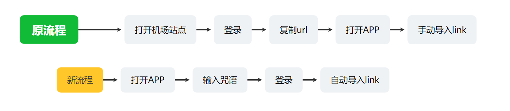

## Материалы

- [karing](https://github.com/KaringX/karing/releases/latest) version >= 1.0.37.490
- [karing-connect](https://github.com/KaringX/karing-connect)
  - Содержит вторичную обертку app-интерфейса `karing.js`
  - А также пример кода подключения для v2board и sspanel

## 1. Демонстрация

### Подключение провайдера к Karing

- Видео ниже показывает ситуацию, когда провайдер(сервис/ISP-сайт) и Karing настроены для подключения
- Пользователь завершает цикл входа в приложении и входит в аккаунт на странице провайдера
  - Конфигурация импортируется автоматически, данные провайдера автоматически подтягиваются и перезаписывают стандартную конфигурацию Karing.

- Видео-демонстрация:
- <video controls width="320">
    <source src="/videos/v2board-1.mp4" type="video/mp4" />
    Ваш браузер не поддерживает HTML5-видео.
  </video>

### Сравнение процесса

- По сравнению с полным процессом использования VPN/прокси-приложения, способ `karing-connect` значительно упрощает работу.
- Особенно для начинающих пользователей: не нужно понимать подписки и конфигурации, достаточно знать `заклинание` и `аккаунт провайдера`

- 

## 2. Что такое karing-connect {#point}

- Пользователь открывает страницу входа провайдера(VPN-сервиса) из встроенного webview-контейнера Karing, и после входа конфигурация импортируется автоматически.

### Преимущества после завершения подключения

- Замкнутый цикл входа пользователя, подключение в один клик.
- Информация провайдера внутри APP
  - Можно добавить главную страницу провайдера, FAQ, поддержку, социальные аккаунты и т.п., с закрепленным отображением в меню Karing.
- Настраиваемые функции:
  - Поддержка **push-сообщений**, можно настраивать платформу, канал и версию.
  - **Напоминание о продлении** при окончании тарифа, с прямым переходом на страницу продуктов провайдера.
  - _todo_ провайдер может настраивать часть стандартных параметров APP под свои особенности, например ipv6, dns и т.п.
- Без дополнительной рекламы:
  - Рекламный блок `специальный трафик` на странице настроек Karing показывает только ссылку этого провайдера.
  - **В APP больше не показываются другие конкурирующие сервисы**
- Безопасность:
  - Весь код подключения открыт и прозрачен; провайдер также может развернуть его самостоятельно и изменять под свои задачи.
  - Karing не записывает и не собирает логины/пароли.

### Возможности в будущем

- _todo_ владелец провайдера сможет изменять стандартную конфигурацию и правила
- _todo_ специальная версия APP для провайдера: собственный logo, имя, конфигурация

## 3. Способ привязки/подключения

### Три шага

- 1 Зарегистрируйтесь и создайте провайдера на https://harry.karing.app/provider
- 2 Измените код сайта провайдера, добавьте страницу подключения, например `http://v2board.local/karing-connect.html`
  - Загрузите `karing.js`
  - Вызовите метод `config` объекта `_karing` для импорта конфигурации
- 3 В админ-панели провайдера добавьте `заклинание` и адрес страницы подключения

### Примеры подключения

- Если вы используете относительно новые версии sspanel и v2board, ниже уже есть два полных примера:

```mdx-code-block
import DocCard from '@theme/DocCard';

<DocCard
  item={{ type: 'link', label: '🎻Пример: привязка Karing через V2Board', href: '/cooperation/v2board#spell' }}
/>

<DocCard
  item={{ type: 'link', label: '⛷️Пример: подключение SSPanel к Karing', href: '/cooperation/sspanel#spell' }}
/>
```

### Описание файлов karing-connect

```bash
├── karing.js        Вторичная обертка открытого интерфейса Karing APP
├── karing.min.js    Сжатая версия karing.js, без обфускации
├── sspanel
│   └── KaringController.php   Новый контроллер в примере sspanel
└── v2board
    ├── custom.js              JS-код, добавленный в примере v2board
    └── karing-connect.html    Страница подключения примера
```

### Пример использования karing.js

- Сейчас js-файл доступен только по двум адресам, но при наличии условий его можно развернуть на своем сервере.
- harry-сайт: https://harry.karing.app/assets/karing.min.js
- github: https://raw.githubusercontent.com/KaringX/karing-connect/refs/heads/main/karing.min.js

#### Способ загрузки

1. Изменить html

```html
<script src="https://harry.karing.app/assets/karing.min.js"></script>
```

2. JS-загрузка

```jsx
// Создать тег script
var script = document.createElement("script");
script.src = "https://harry.karing.app/assets/karing.min.js";

// После завершения загрузки скрипта выполнить метод
script.onload = function () {
  something_todo();
};

// Добавить тег script в document и начать загрузку JS-файла
document.body.appendChild(script);
```

#### Основные вызовы методов

```jsx
// Предустановить PID
(async function () {
  try {
    // параметры:
    //  PID - id, автоматически назначенный при создании провайдера в панели harry
    //  смысл предустановки в предварительной загрузке конфигурационного файла
    //      1. проверка конфигурации.
    //      2. сокращение последующего ожидания пользователя.
    const result = _karing.prepare(PID);
    if (result == "") {
      // автоматически закрыть подсказку через 3 секунды
      _karing.toast("Successfully prepared, next step...", true, 3);
    } else {
      _karing.error("prepare failed, err:", result);
    }
  } catch (error) {
    console.error("Preparation failed:", error);
  }
})();

// Добавить конфигурацию Karing
window.onload = async function () {
  try {
    // параметры:
    //  PID пустой - app автоматически прочитает значение, заданное prepare
    //  user_nick: ник пользователя
    //  link: ссылка подписки провайдера
    //  link_name: имя подписки, можно использовать имя провайдера
    const result = await _karing.config(null, user_nick, link, link_name);
    if (result == "") {
      // автоматически закрыть подсказку через 3 секунды
      _karing.toast("Import configuration successful, enjoy!", true, 3);
    } else {
      _karing.error("config failed, err:", result);
    }
  } catch (error) {
    console.error("Configuration failed:", error);
  }
};
```

## 4. Сотрудничество с Karing

- Нажмите, чтобы перейти 👉 [контакты и формы сотрудничества](/blog/isp/cooperation)
