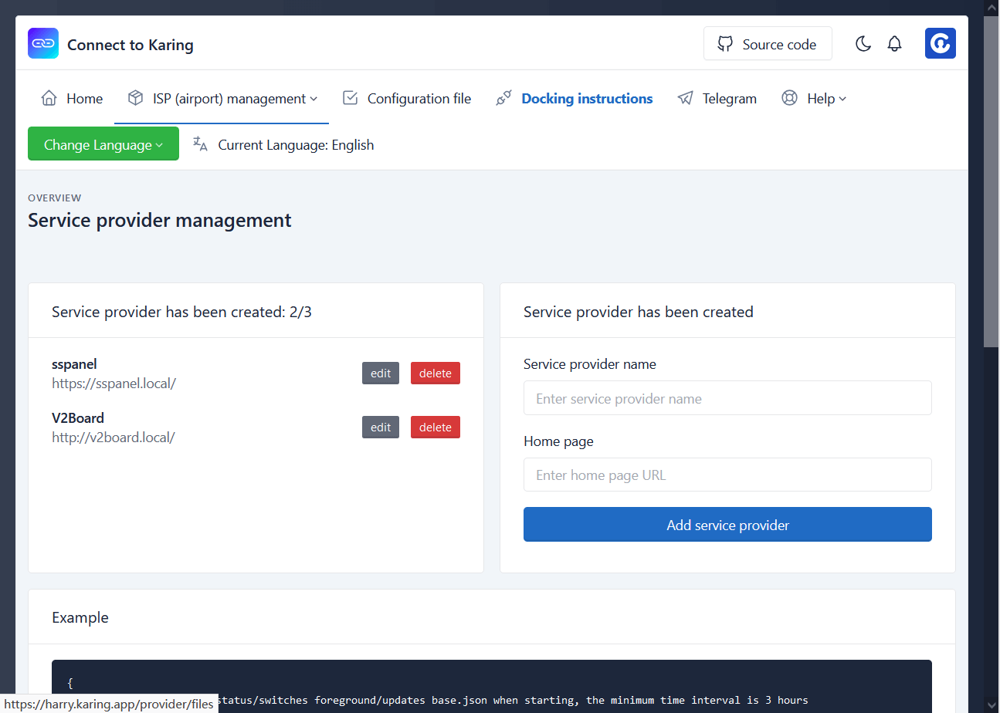
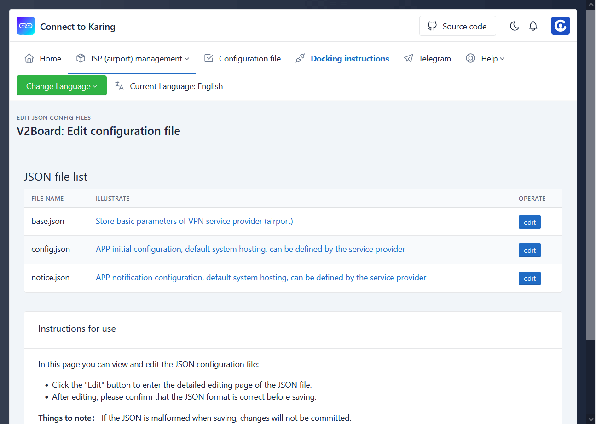

## Описание

- **Провайдер**: владелец сервиса, оператор, VPN provider, ISP; далее все обозначаются как "провайдер"
- Вход для регистрации и входа: https://harry.karing.app/auth/login
  - Регистрация сразу выполняет вход, проверяется только email
- Сейчас доступны только две функции:
  - Создание/удаление провайдера(сервиса)
  - Изменение конфигурационных файлов провайдера(сервиса)

## Действия

### Управление провайдерами

- После успешного входа справа в интерфейсе можно создать нового провайдера.
- Слева отображается список провайдеров текущего аккаунта.
- Нажмите “编辑/edit”, чтобы открыть конфигурационные файлы этого провайдера.
- Нажмите “删除/delete”, чтобы удалить провайдера.

- Скриншот:
- 

### Редактирование конфигурационных файлов

- Отображается список [конфигурационных файлов](#files), которые текущий провайдер использует в Karing APP
- Нажмите “编辑/edit”, чтобы открыть страницу редактирования текущего файла, редактор jsoneditor
- Например, в base.json можно изменить:
  - имя текущего провайдера, главную страницу ...
  - настройки подключения Karing connect, список [заклинаний](/cooperation/harry/spell) spells
  - адреса других конфигурационных файлов и т.п.
- Нажмите "说明/illustrate" у файла, чтобы открыть wiki-страницу файла с инструкциями и комментариями к полям.

- Скриншот:
- 

### Ограничения

- Один аккаунт может создать 3 провайдера(сервиса/ISP)
- Один провайдер может создать 2 заклинания, рекомендуется использовать имя сайта или английскую фразу

## Комментарии к конфигурационным файлам {#files}

- [base.json](/cooperation/harry/base.json) базовая информация провайдера(сервиса)
- [config.json](/cooperation/harry/config.json) конфигурационный файл APP
- [notice.json](/cooperation/harry/notice.json) уведомления APP
