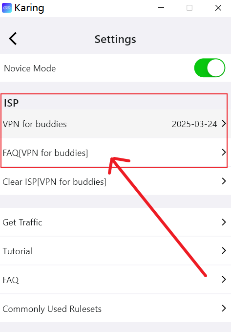
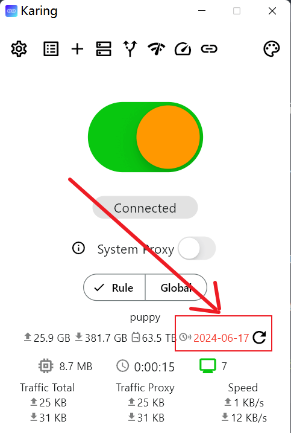
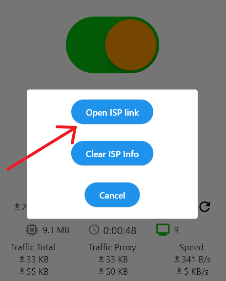
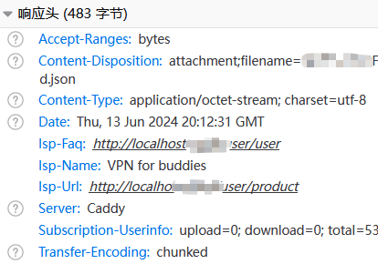

# Интеграция меню провайдера(ISP)

- Если хотите только посмотреть результат, перейдите к [скриншоту меню](#demo)

Интеграция ссылки ISP(провайдера) с меню Karing решает следующие задачи:

1. После добавления конфигурации пользователю будет напоминаться о продлении при окончании тарифа, что повышает повторные покупки;
2. Если **домен провайдера перестал работать**, был заблокирован wall/banned и т.п., достаточно изменить header подписки, чтобы обновить вход
   - Пользователь этого не заметит
3. Есть два способа показать информацию провайдера на странице Karing - Настройки:
   - Вариант A: настроить на `harry.karing.app`; конечный пользователь через `заклинание` переходит на страницу входа провайдера, после успешного входа конфигурация импортируется и отображается информация провайдера.
   - Вариант B: изменить `HEADER` `ссылки подписки` провайдера и добавить информационное содержимое.
   - Оба варианта дополняют друг друга и имеют свои плюсы/минусы. С точки зрения пользовательского опыта и бренда провайдера рекомендуется _вариант A_
   - Но вариант B может быть более универсальным; ниже описан именно **вариант B**

### 1. Примеры панелей управления провайдеров

- Если ваша система есть в списке ниже, переходите сразу к шагам настройки
- [Пример SSPanel-Uim](/cooperation/sspanel#link)
- [Пример V2Board](/cooperation/v2board#link)

## 2. Демонстрация

### Меню настроек {#demo}

- В Karing - меню настроек - сверху отображаются `имя провайдера`, `срок действия сервиса`, `FAQ провайдера`
- Пользователь может нажать `имя провайдера`, чтобы перейти к продлению или покупке нового тарифа
- Как на изображении: 

### Напоминание об окончании сервиса

- Когда до окончания сервиса пользователя осталось меньше 7 дней, отображается красное <font color='red'>напоминание об окончании</font>

- Пользователь может нажать красное <font color='red'>время окончания</font>, чтобы перейти к продлению у провайдера
- Как на изображениях:
  - 
  - 

## 3. Логика настройки

- Ниже два варианта. Рекомендуется способ изменения header, он меньше вмешивается в код.

### Вариант 1: изменить HTTP-заголовки(header)

- В HTTP-ответ(response) ссылки подписки добавьте четыре _заголовка ответа_
  - (обязательно) **Subscription-Userinfo**
    - Используется для отображения уже загруженного/скачанного/общего трафика пользователя и срока действия тарифа
    - `upload= ; download= ; total= ; expire= ;`
  - (обязательно) **isp-name**: имя вашего сервиса(имя провайдера)
    - Отображается в Настройки - ISP - первая строка
    - Если isp-name содержит не-ASCII символы(например китайский), нужно использовать urlencode
  - (обязательно) **isp-url**: URL, на который пользователь переходит при нажатии isp-name
  - (опционально) _isp-faq_: URL FAQ вашего сервиса
    - Отображается в Настройки - ISP - вторая строка
- После изменения можно увидеть через инструмент отладки, как на изображении:
  - 

### Вариант 2: пользовательский URL Scheme

- Karing поддерживает вызов страницы `Добавить конфигурацию` через scheme. Ссылку `автоматический импорт Karing` можно заменить на формат ниже

```html
<a
  href="karing://install-config?url=xxxx&name=xxx&isp-name=xxx&isp-url=xxx&isp-faq=xxx"
  >Автоматически импортировать в Karing</a
>
```

- Примечание:
  - url должен быть экранирован через urlencode

### Приоритет отображения

1. По умолчанию меню ISP показывает только одну информацию ISP
   - Если у пользователя несколько конфигураций подписки, отображается первая с действительной isp-информацией согласно сортировке
2. Приоритет scheme выше header
   - Сначала отображается isp-информация, заданная через karing://install-config; если ее нет, проверяется response header

## 4. Сотрудничество с Karing

- Нажмите, чтобы перейти 👉 [контакты и формы сотрудничества](/blog/isp/cooperation)
