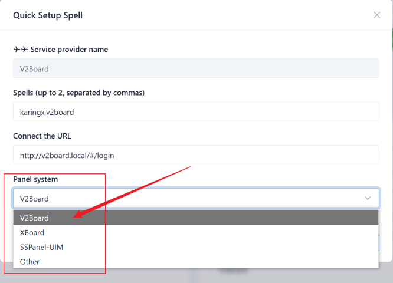
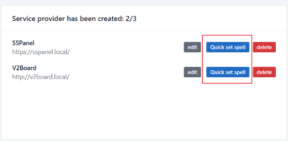
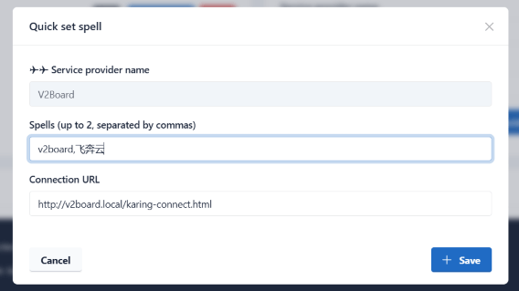

# Изменение XBoard для интеграции с Karing

### Материалы

- Xboard 0.1.1-dev: https://github.com/cedar2025/Xboard
  - Xboard - это панель, вторично разработанная на базе V2board, с большинством улучшений в производительности и функциях
- karing-connect: [https://github.com/KaringX/karing-connect](https://github.com/KaringX/karing-connect/tree/main/xboard)
  - Содержит файлы, изменяемые в этом примере
  - Файл custom.js в этом примере изменен на основе примера v2board, основные отличия:
    - имена объектов HTML-элементов
    - путь получения Authorization

### Видео-пример

- Заклинание: `xboard`
- Страница подключения провайдера: `http://xboard.local/karing-connect.html`
- Демонстрация:
- <video controls width="320">
    <source src="/videos/xboard-1.mp4" type="video/mp4" />
    Ваш браузер не поддерживает HTML5-видео.
  </video>

## Вариант A: быстрая привязка Karing {#shortcut}

- Karing уже содержит код автоматической привязки для последних версий(>=2024.1) sspanel, v2board, xboard. Достаточно выбрать соответствующую систему в поле системы.
  - В этом варианте не нужно менять систему панели и добавлять страницу подключения; в параметр `connect` достаточно указать URL входа на сайт.
  - 
- Если после выбора системы панели и тестирования привязка не завершается, выберите “Other” и попробуйте **вариант B**

## Вариант B: привязка Karing через заклинание {#spell}

### Идея

- **Дисклеймер**: автор не является специалистом по xboard/v2board и frontend, пример сделан по личной логике.
  - Если есть лучший способ, пожалуйста, поделитесь им: отправьте [connect issue](https://github.com/KaringX/karing-connect/issues) или свяжитесь с автором [@elon](https://t.me/ElonWang)
- Сначала Karing APP открывает промежуточную страницу `karing-connect.html`
  - Устанавливает cookie `karing=connect` как метку входа подключения Karing
  - Переходит на `/#/login`
- Затем открывается frontend-страница Xboard и загружается пользовательский JS-файл `custom.js`
  - 1 Проверяет, находится ли страница в webview-контейнере Karing и есть ли cookie-метка
  - 2 Проверяет, вошел ли текущий пользователь
  - 3 Загружает JS-файл интеграции `karing.js`
  - 4 Вызывает backend API `/api/v1/user/getSubscribe`, чтобы получить информацию пользователя и ссылку подписки
  - 5 Вызывает метод `_karing` для импорта информации пользователя
- В конце Karing APP получает информацию, проверяет ее и завершает привязку провайдера.

### Предварительная настройка Xboard

- В локальном примере используется рекомендуемая установка через docker-compose: [быстрое развертывание Docker Compose из командной строки](https://github.com/cedar2025/Xboard/blob/dev/docs/docker-compose%E5%AE%89%E8%A3%85%E6%8C%87%E5%8D%97.md)
  - version: 0.1.1-dev
  - image: ghcr.io/cedar2025/xboard:latest
- Xboard работает на webman
- Общий каталог контейнера `.docker/.data:/var/www/.docker/.data`

### Первый шаг: система Xboard

#### 1.1 Добавить новые файлы

- Добавьте два файла в каталог Xboard
- custom.js: [`public/theme/Xboard/assets/custom.js`](https://github.com/KaringX/karing-connect/blob/main/xboard/custom.js)
- karing-connect.html: [`public/karing-connect.html`](https://github.com/KaringX/karing-connect/blob/main/xboard/karing-connect.html)
  - _Примечание_: если используете другую тему, замените `theme/Xboard` в пути custom
  - Актуальный адрес файлов: - https://github.com/KaringX/karing-connect/tree/main/xboard

#### 1.2 Подключение custom.js

- Стандартная тема Xboard не проверяет и не загружает `custom.js`. Ниже два способа загрузки.

##### Способ 1: изменить dashboard.blade.php

- Внизу [`public/theme/Xboard/dashboard.blade.php`](https://github.com/KaringX/karing-connect/blob/main/xboard/dashboard.blade.php), перед body, добавьте условие:

```jsx title="/www/public/theme/Xboard/dashboard.blade.php"
... ...

  @if (request()->cookie('karing') === 'connect')
      @if (file_exists(public_path("/theme/{$theme}/assets/custom.js")))
        <script src="/theme/{{$theme}}/assets/custom.js?v={{$version}}"></script>
      @endif
  @endif
</body>

... ...

```

##### Способ 2: изменить настройки темы в админ-панели

- Войдите в админ-панель Xboard
- Настройки темы - Xboard - Настройки темы - пользовательский HTML footer
- Вставьте туда script-тег для `custom.js`

- _tip_: в этом примере используется первый способ. Хотя он требует изменения кода, плюс в том, что js не загружается, если не идет процесс привязки Karing

#### 1.3 Описание custom.js

- custom загружает удаленный файл `karing.min.js`
  - Также можно скачать исходный файл с GitHub и развернуть самостоятельно.
  - Кроме имени интерфейса, разработанного Karing, остальные части можно менять под свои задачи.
  - Исходный файл не зашифрован и содержит комментарии.
    - https://github.com/KaringX/karing-connect/blob/main/karing.js
- Параметр debug в файле по умолчанию false. Если установить true:
  - В терминал выводятся логи
  - Не проверяется наличие объекта window.karing, процесс симулируется напрямую
    - В итоге будет ошибка: импорт конфигурации не удался.

### Второй шаг: панель harry.karing.app

#### Способ 1: быстрая настройка заклинания

- Войдите в harry, список провайдеров, нажмите кнопку `Настроить заклинание`.
  - 
- Настройте заклинание и connect url
  - 

#### Способ 2: изменить конфигурационный файл `base.json`

- Поле _connect_
- Поле заклинаний _spells_, рекомендуется использовать имя провайдера.

```js
{
    "pid": 123456,
 	...

 	"connet": "https://your-domain/karing-connect.html",
    "spells": [
        '急速云',
        'RapidNetwork',
    ],
    ...
}
```

### В конце: тест привязки

- Karing APP -> Настройки -> ISP/привязка провайдера -> введите заклинание -> войдите в Xboard -> привязка завершена
