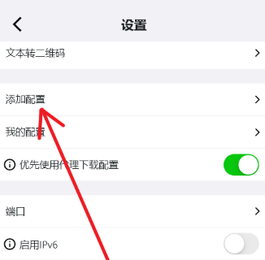
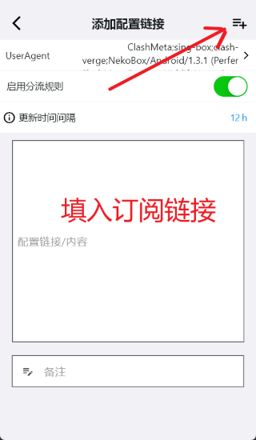
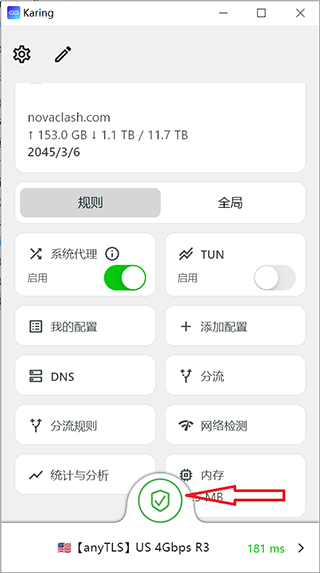
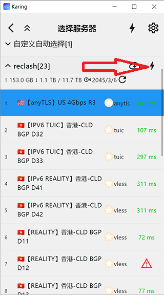

# Быстрый старт

- Это официальное вводное руководство Karing. Оно следует принципу простоты и практичности, поэтому объяснения здесь максимально краткие.

### Основные возможности

- Простое использование, быстрый старт, подключение в один клик.
- Поддержка ссылок и импорта конфигураций Clash/Clash.Meta, Sing-box, V2ray(поддерживается пакетный импорт), Stash, Shadowsocks, Sub, GitHub.
- Поддержка основных протоколов, включая Shadowsocks, ShadowsocksR, VMess, Vless, Trojan, Tuic, Socks, Http, Hysteria, Hysteria2, Wireguard, AnyTLS, Mieru и другие.
- Один набор правил маршрутизации применяется к нескольким источникам подписок и автоматически выбирает эффективные узлы.
  - Поддерживаются пользовательские группы правил маршрутизации и группы узлов.
  - Для новичков предусмотрен стандартный набор правил маршрутизации, готовый к использованию сразу после установки.
- Встроена поддержка модифицированного ядра sing-box с высокой производительностью.
- Поддерживаются резервное копирование и синхронизация: настройте один раз и синхронизируйте на нескольких устройствах.
- Добавлен режим новичка, который упрощает настройку.

## Системные требования

- iOS >= 15
- macOS >= 12
- tvOS >= 17
- Android >= 8
- Windows >= 10

### Предпросмотр интерфейса

## 1. [Скачать](/download)

### iOS(iphone/ipad)/tvOS(appleTV)

- AppStore(поисковый запрос: karing vpn)
  - https://apps.apple.com/us/app/karing/id6472431552
- TestFlight
  - https://testflight.apple.com/join/RLU59OsJ
- Примечание: нужен AppStore-аккаунт не из материкового Китая
  - Не знаете, как зарегистрировать? См. [магазин Apple ID](https://dot.karing.app/pi.html?r_c=xda)

### Другие платформы

- [Скачать](/download)

### Стоимость

- Karing **бесплатен** на всех платформах

:::tip Рекомендации

- Здесь собраны некоторые относительно надежные платные узлы: [обмен узлами](/blog/isp/cn#list)
- Как получить бесплатный трафик, см. [бонусы для новых пользователей](/newuser)

:::

## 2. Быстрое использование/quickstart

1. Нажмите кнопку настроек в левом верхнем углу приложения -> откройте `Добавить конфигурацию`
   - Откройте `Добавить ссылку конфигурации`(также можно добавить импортом или сканированием)
     - 
   - Вставьте ссылку или содержимое конфигурации Clash/sing-box/V2ray/SS и т.п. в поле ввода
     - Если у вас нет конфигурации, можно подать заявку через [бонусы для новых пользователей](/newuser)
   - Нажмите кнопку добавления в правом верхнем углу
     - 

2. Вернитесь на главный экран
   - По умолчанию для вас уже выбран сервер
     - Нажмите имя сервера внизу, чтобы выбрать сервер заново
   - Нажмите Подключить(кнопка-переключатель), чтобы начать использовать сеть
     - 

### Как выбрать более быстрый сервер

- Нажмите имя сервера внизу главного экрана, затем откройте 'Выбор сервера'
- Нажмите кнопку 'Проверка задержки'
  - 
- Через некоторое время рядом с каждым сервером отобразится задержка
  - Чем меньше значение задержки, тем лучше
  - Треугольный индикатор означает ошибку: сервер может быть недоступен. Нажмите его, чтобы посмотреть подробности ошибки
- Выберите сервер с низкой задержкой
- Рекомендуется использовать функцию `Автоматический выбор` сервера

### Как использовать версию для Apple TV(tvos)

- Скачайте и установите Karing для Apple TV(tvos) и мобильную версию Karing
- На мобильном устройстве добавьте конфигурацию по шагу [1] выше
- Откройте Karing на Apple TV
- Сканируйте QR-код Karing на Apple TV с мобильного устройства, где установлен Karing
- После успешного сканирования и подключения мобильный Karing откроет центр управления Apple TV
- Нажмите кнопку [Загрузить] в правом верхнем углу, чтобы синхронизировать основную конфигурацию. После синхронизации в Karing на Apple TV появится дополнительная кнопка [Подключить]
- Вернитесь к Karing на Apple TV и включите подключение
- После успешного подключения Karing на Apple TV можно смотреть состояние в центре управления Apple TV в мобильном Karing

## 3. Расширенные функции

- 👉[Встроенный набор правил разделения трафика](/tutorial/diversion)
- 👉[Пользовательские правила разделения трафика и группы узлов](/tutorial/custom-diversion)
- 👉[Входящий прокси по приложениям(Android)](/tutorial/perapp-proxy)
- 👉[Резервное копирование и синхронизация конфигурации между устройствами](/tutorial/backup-sync)

## В конце: частые вопросы/FAQ

- Можно ли установить Karing на USB-накопитель и носить с собой? 👉[Портативная конфигурация(Windows)](/tutorial/portable)
- Я ISP(владелец сервиса подписок)
  - Как интегрировать мою ссылку тарифа в Karing? 👉[Интеграция ISP](/cooperation/menu)
  - Как написать быструю ссылку для импорта конфигурации Karing в один клик? 👉[Формат scheme](/cooperation/scheme)

- Другие вопросы см. в [FAQ](/faq/)
