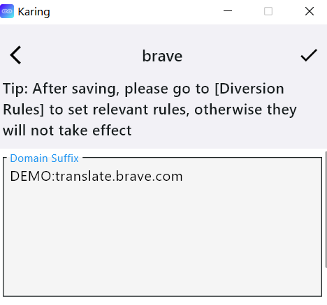
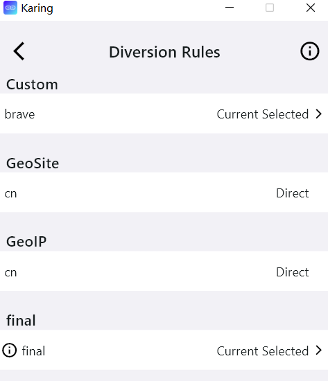
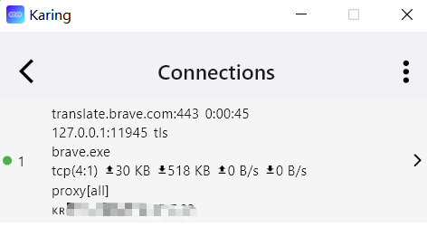

# Пользовательское разделение трафика

- Если встроенных правил geo(-ip, -site) и ACL недостаточно, попробуйте `пользовательские группы разделения` и `пользовательские группы прокси/пользовательский автоматический выбор`

## Материалы

- karing >= 1.0.15.133
- Brave 1.67.116
  - Только для примера ниже

## Пользовательская группа разделения

- В качестве примера используется функция для _решения проблемы, когда перевод Brave не работает в материковом Китае_.

### Шаги настройки

1. Добавьте группу разделения

- Настройки -> Разделение -> Правила разделения -> Редактировать -> `Пользовательская группа разделения` -> кнопка ➕ в правом верхнем углу -> нажмите первую кнопку ➕, добавьте группу разделения и укажите примечание brave

2. Добавьте правило

- Вернитесь к списку `Пользовательская группа разделения`, выберите только что созданное имя примечания
- Заполните нужное правило, на примере brave:
  - В `Domain Suffix` введите "translate.brave.com", примечание: не добавляйте символы `DEMO:`
  - Нажмите ✔ слева сверху для сохранения
  - 

3. Выберите действие при совпадении правила

- Вернитесь на первый экран Правила разделения, в пользовательской группе выберите brave(имя примечания созданного правила)
- Выберите действие **Текущий выбор**
  - 

4. Вернитесь на главный экран Karing и переподключитесь, чтобы настройки вступили в силу

- Выключите кнопку "Подключение", затем снова включите. Фон кнопки станет зеленым

5. Проверьте работу

- Откройте страницу в браузере Brave, правый клик -> Перевести
- Главный экран Karing -> Подключения(иконка 💻)
  - 

**Примечание**: все данные в правилах чувствительны к регистру

### Глоссарий

:::tip Глоссарий
Domain Suffix: суффикс домена

- Например, ads.google.com и api.google.com имеют одинаковый суффикс домена .google.com,
- Если суффикс домена совпадает с .google.com, правило срабатывает;

Domain: полный домен

- Правило срабатывает только при полном совпадении

Domain Keyword: ключевое слово домена

- Если в домене есть указанное ключевое слово, правило срабатывает
- Например, ads.google.com и ad.google.cn содержат ключевое слово google;

IP Cidr: диапазон IP

- Если сопоставляется конкретный ip, после / должна быть полная маска;

Rule Set: удаленный набор правил

- Поддерживаются форматы srs и json
- Примечание: для правил на GitHub используйте кнопку Raw на странице, чтобы получить адрес скачивания файла

Rule Set(build-in): встроенный набор правил(geosite, geoip, acl)

Process Name: имя процесса Windows

Process Path: полный путь процесса Windows

App Package: id пакета Android-приложения
:::

## Пользовательская группа прокси/пользовательский автоматический выбор

- Шаги аналогичны группе разделения, поэтому здесь не повторяются
