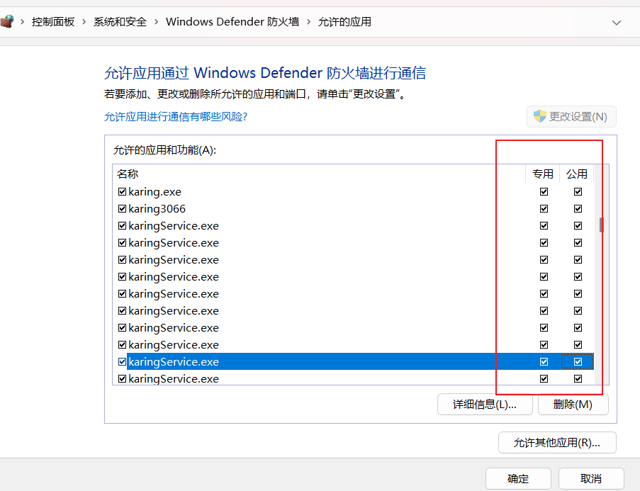
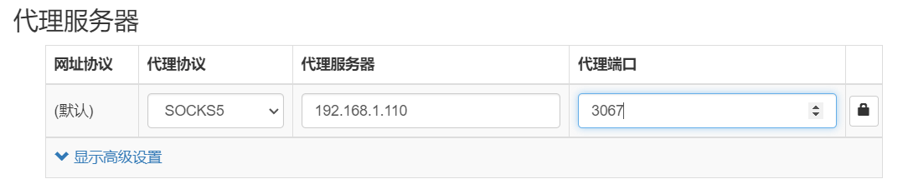

# Использование Karing как прокси-сервиса для других устройств в локальной сети

- Предоставляет socks/http прокси для других устройств в локальной сети(в той же подсети)

## Материалы

- Система: windows11
- karing: 1.0.24.283

## Разрешить Karing в брандмауэре Windows Defender

- Откройте Windows `Панель управления` -> `Брандмауэр Windows Defender` -> `Разрешить приложение через брандмауэр Windows`
  - Отметьте для приложения Karing пункты `Частная` и `Общедоступная`.
  - Если вы точно различаете, какая сеть `частная`, а какая `общедоступная`, можно отметить только нужные.

- Как на изображении:
  - 

### Tips

- Как посмотреть текущий тип сети:
  - `Панель управления` -> `Сеть и Интернет` -> `Просмотр состояния сети и задач`

- Пример: настройка брандмауэра Windows описана в статье `blog/case/wsl2`.

## Настройки Karing

- `Настройки` -> отключите `Режим новичка`
- Настройки -> Общий доступ к сети -> включите `Разрешить доступ другим хостам`
  - Посмотрите `Сетевой интерфейс`, чтобы получить текущий IP-адрес, например: **192.168.1.x**
- `Настройки` -> `Порты` -> получите текущие открытые порты, по умолчанию:
  - По правилам **3067**
  - Полностью прямое подключение **3065** (удобно для отладки)
  - Полностью через прокси **3066**

### Настройка прокси на других устройствах

- Karing использует смешанный режим прокси, то есть поддерживаются socks/http/https
- По данным из предыдущего шага:
  - Ссылка по правилам: `socks5://192.168.1.110:3067`
  - Ссылка полностью через прокси: `socks5://192.168.1.110:3066`
  - Ссылка для **локальных приложений**: `socks5://127.0.0.1:3067`

- Скриншот настройки proxy:
  - 
