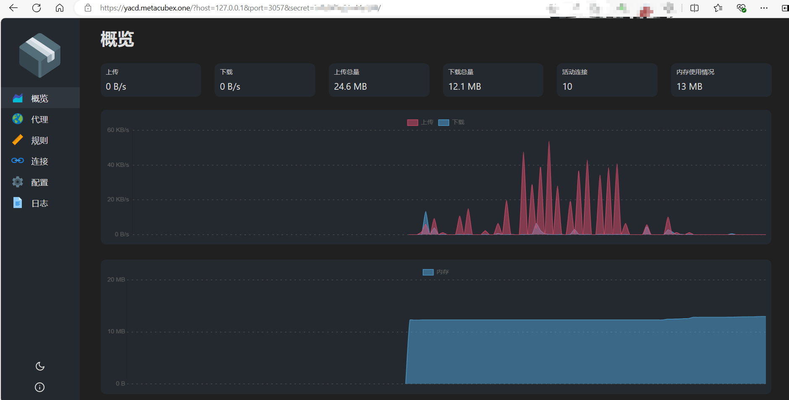
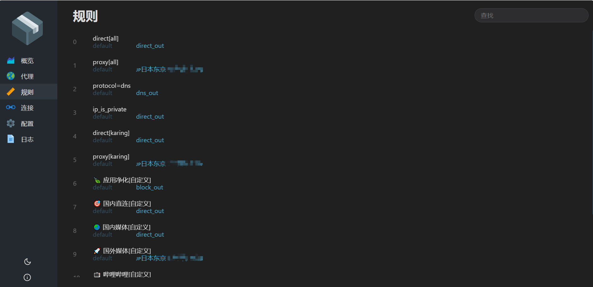

---
---

# Онлайн-панель

- Удобно для пользователей, которым непривычен UI Karing, но нравится традиционный интерфейс в стиле Clash.

- **MetaCubeXD** https://metacubexd.pages.dev/#/setup
- **zashboard** https://board.zash.run.place/#/setup

## Использование панели, встроенной в приложение

- Настройки -> `Онлайн-панель` -> автоматически открывает интерфейс yacd в браузере по умолчанию
- URL: `http://127.0.0.1/?hostname=127.0.0.1&port=3057&secret=xxxx`

### IP и порт по умолчанию

- hostname: 127.0.0.1
- port: 3057
- secret: можно получить в конфигурационном файле `service_core.json`

### Скриншоты

- 
- 
