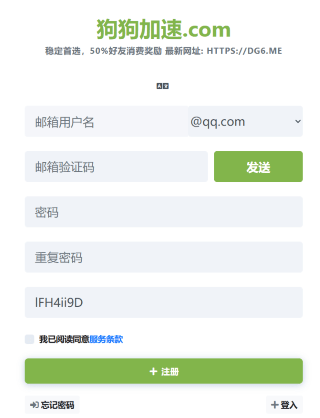
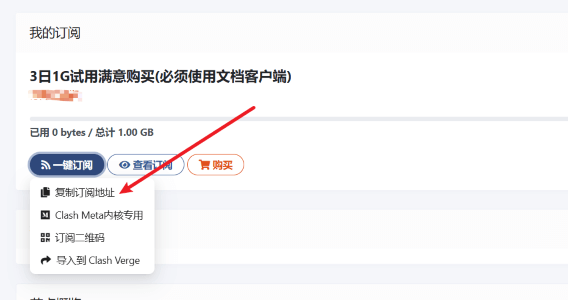

## 如何领取免费流量 ？
由于平台限制,免费流量仅限新注册用户(**数量有限**)
### 1. 注册账号
- 浏览器中打开链接 [https://panel.dg6.top/#/register?code=lFH4ii9D](https://panel.dg6.top/#/register?code=lFH4ii9D)
- 输入电子邮箱,登录密码, 点击 *邮箱验证码*边的 `发送` 按钮, 获取邮箱验证码
  - 点击后到你的邮箱里查收验证码, 将验证码填入到 `邮箱验证码` 一栏，点击注册
  - PS: 如果收件箱中没有, 可能在垃圾箱中

- 

### 2. 注册成功后登录到后台,进入后台的仪表盘,如下图

    - 

### 3. 点击 '复制订阅地址' 复制链接
- 回到karing-设置-添加配置链接
- 粘贴链接到输入框, 点击 右上角 添加订阅 即完成添加
- 返回到karing主屏点击“启动”即可开始使用免费流量

